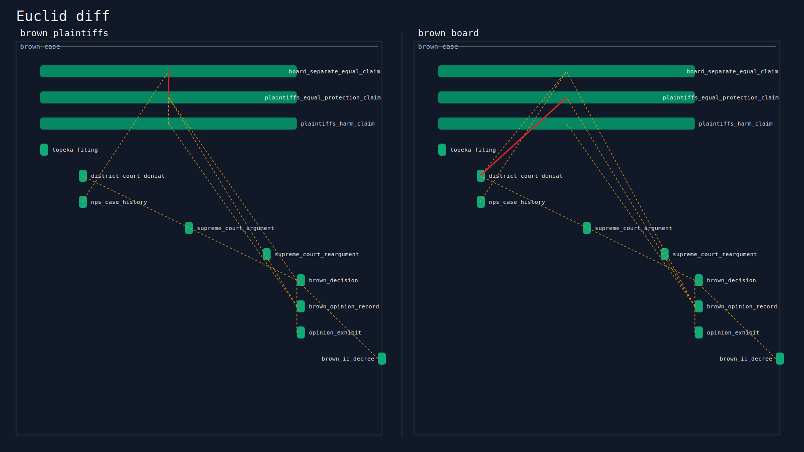
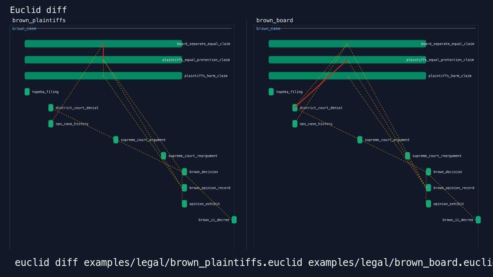
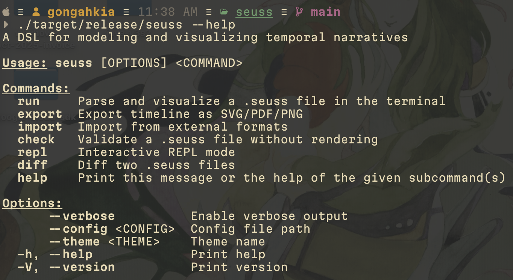
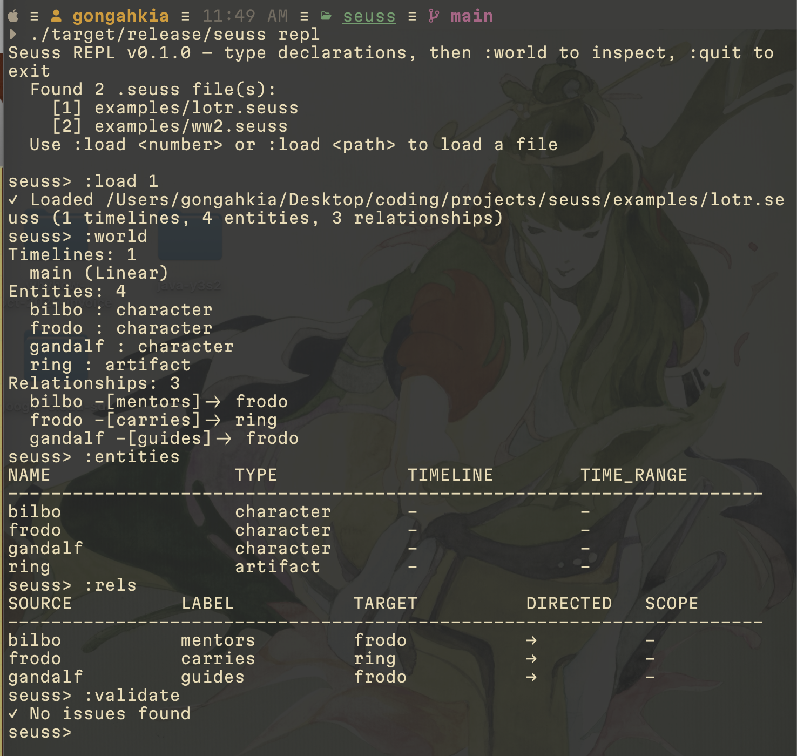
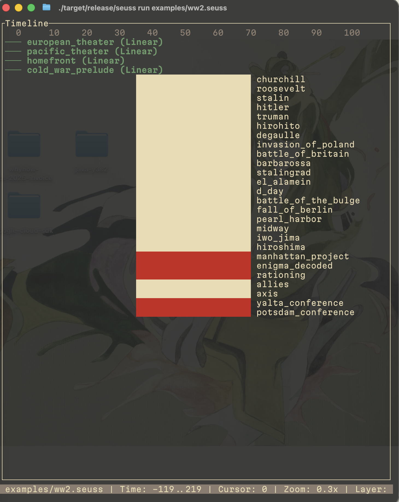
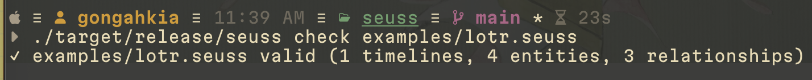
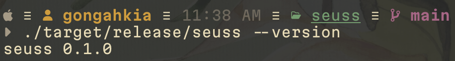
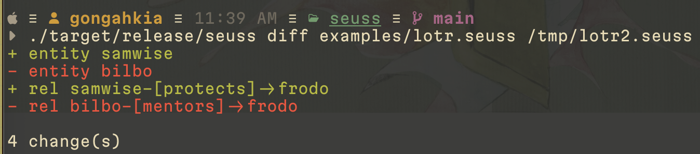
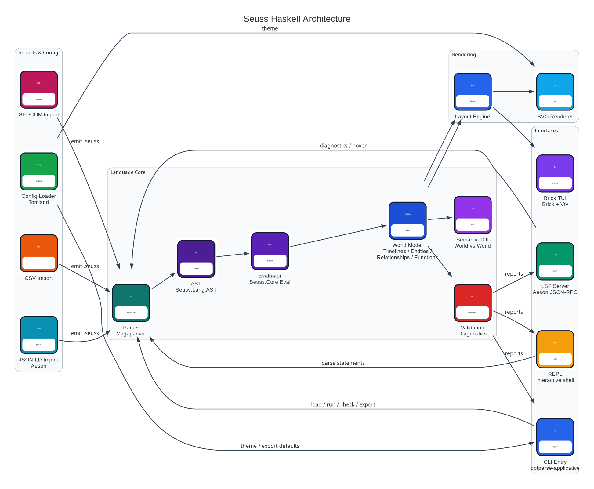

# `Euclid`

**Litigation timelines as code.**

`git diff for facts.`

<div align="center">
    
</div>

Euclid is a Haskell DSL for modeling legal chronologies, investigations, depositions, discovery narratives, and other timelines where the order of facts matters. Write timelines as source files, review them like code, and compare two competing narratives with `euclid diff`.

```console
$ euclid diff examples/legal/brown_plaintiffs.euclid examples/legal/brown_board.euclid
```

<div align="center">
    
    <br>
    <sub>Generated from committed `.euclid` files with `./scripts/generate_demo_assets.sh`.</sub>
</div>

<details>
<summary>Animated diff flow</summary>

<div align="center">
    
</div>

</details>

The legal framing is concrete, but the core is general: branching timelines, typed entities, relationships, imports, validation diagnostics, a terminal explorer, an LSP server, and exports for SVG, HTML, JSON, Markdown, and Mermaid.

Euclid is a modeling tool, not legal advice and not a hosted case platform. The goal is a small, inspectable language that makes narrative structure visible in a repo, a terminal, and a README.

## Why timelines as code?

Legal and investigative timelines often contain more than dates. They contain claims, facts, witnesses, exhibits, citations, and contradictions. A text DSL makes those choices explicit:

```euclid
timeline plaintiff_narrative {
    kind: linear,
    start: 2024-01-01,
    end: 2024-12-31,
}

entity notice_record : evidence {
    citation: "Ex. 12",
    source: "Discovery production",
    bates: "ACME_000012",
    appears_on: plaintiff_narrative @ 2024-03-04..2024-03-04,
}

entity notice_denied : claim {
    citation: "Dep. 44:8",
    appears_on: plaintiff_narrative @ 2024-03-05..2024-03-05,
}

rel notice_record -["contradicts"]-> notice_denied;
```

Euclid's differentiator is not drawing a generic timeline. It is keeping timelines, branches, entities, relationships, and diffs in plain source form so they can be reviewed, rendered, and compared.

## Quick Start

```console
$ git clone https://github.com/gongahkia/euclid && cd euclid
$ cabal update
$ cabal build all
$ cabal run euclid -- --help
$ cabal install exe:euclid --installdir="$HOME/.local/bin" --overwrite-policy=always
```

Run the shipped examples:

```console
$ euclid check examples/legal/brown_plaintiffs.euclid
$ euclid check examples/legal/brown_board.euclid
$ euclid diff examples/legal/brown_plaintiffs.euclid examples/legal/brown_board.euclid
```

Export timelines:

```console
$ euclid export examples/legal/brown_plaintiffs.euclid -f svg -o brown-plaintiffs.svg
$ euclid export examples/legal/brown_board.euclid -f html -o brown-board.html
$ euclid export examples/historical/ww2.euclid -f mermaid -o ww2.mmd
```

Mermaid output can be pasted into GitHub-native `mermaid` code fences for lightweight README embeds.

## Current Surfaces

* `diff` renders semantic differences across timelines, entities, and relationships.
* `run` opens the Brick-based terminal explorer.
* `repl` supports interactive loading, validation, timeline summaries, entity lists, and relationship views.
* `lsp` provides completions, hover, and diagnostics over stdio.
* `export` writes SVG, HTML, JSON, Markdown, or Mermaid output.
* `import` converts CSV, GEDCOM, and JSON-LD into `.euclid` source.
* `euclid-playground-wasi` exposes check/export as JSON over stdin/stdout for browser WASM hosts.

## Commands

### Commands and flags

| Command | Description |
|---------|-------------|
| `euclid run <file>` | Parse a `.euclid` file, validate it, and open the Brick-based terminal explorer |
| `euclid run <file> --narrative plaintiffs` | Open the TUI filtered to one narrative plus neutral shared context |
| `euclid export <file> -f svg -o out.svg` | Export a `.euclid` file as SVG |
| `euclid export <file> --narrative plaintiffs -f json` | Export one narrative plus neutral shared context |
| `euclid check <file>` | Parse and validate a `.euclid` file without opening the TUI |
| `euclid contradict <file>` | List modeled contradiction edges with supporting evidence on both sides |
| `euclid diff <file1> <file2>` | Render a semantic diff of timelines, entities, and relationships |
| `euclid diff <file1> <file2> -f svg -o diff.svg` | Render a side-by-side visual diff with narrative colors and contradiction connectors |
| `euclid exhibits <file>` | Emit a filing-style exhibit list as CSV |
| `euclid import <file> --from csv` | Import CSV, GEDCOM, or JSON-LD data into `.euclid` source |
| `euclid repl` | Start the interactive REPL with `:load`, `:world`, `:entities`, and `:rels` |
| `euclid lsp` | Run the stdio language server for completions, hover, and diagnostics |

| Flag | Description |
|------|-------------|
| `--verbose` | Print extra startup and command execution details |
| `--config <path>` | Path to a TOML config file for export defaults and theme settings |
| `--theme <name>` | Theme: `dark`, `light`, or a path to a custom TOML theme |
| `--narrative <name>` | Filter `run` and `export` to entities with that `narrative` field while retaining neutral entities |

## Syntax

Learn more about `Euclid`' syntax at [`SYNTAX.md`](./docs/SYNTAX.md).

The legal walkthrough lives at [`docs/LEGAL.md`](./docs/LEGAL.md). Examples live in [`./examples`](./examples/), with legal examples first and historical/generative examples kept as secondary showcases.

Mermaid export notes live at [`docs/MERMAID.md`](./docs/MERMAID.md).

Browser WASM build notes live at [`docs/WASM.md`](./docs/WASM.md).

### REPL commands

| Command | Description |
|---------|-------------|
| `:load <n>` or `:load <path>` | Load a `.euclid` file by index or path |
| `:files` / `:f` | Re-scan and list available `.euclid` files |
| `:world` / `:w` | Show summary counts for timelines, entities, relationships, and types |
| `:entities` / `:e` | Print each entity with its type and appearance count |
| `:rels` / `:r` | Print each relationship in semantic edge form |
| `:validate` / `:v` | Run structural validation and print diagnostics |
| `:timeline` / `:t` | Render a text timeline grouped by timeline name |
| `:quit` / `:q` | Exit the REPL |

### TUI commands

#### Navigation

| Key | Action |
|-----|--------|
| `Tab` | Cycle the active pane (Timelines → Entities → Relationships → Inspector) |
| `k` / `↑` | Move the selection up in the active pane |
| `j` / `↓` | Move the selection down in the active pane |
| `Enter` | Follow the current selection into the next relevant pane |
| `q` | Quit |

#### Entity interaction

| Key | Action |
|-----|--------|
| `Enter` | Follow the selected timeline, entity, or relationship |
| `t` | Cycle the entity-type filter |
| `n` | Toggle neighborhood-only relationship mode |
| `s` | Jump from the selected relationship to its source entity |
| `g` | Jump from the selected relationship to its target entity |

#### Modes

| Key | Action |
|-----|--------|
| `/` | Enter search mode to filter visible entities |
| `:` | Open the command palette (`help`, `compare`, `bookmark`, `clear-search`, `clear-filters`) |
| `?` | Toggle help overlay |
| `c` | Cycle the timeline used for comparison in the inspector |
| `Esc` | Exit search or command mode |

#### Time controls

| Key | Action |
|-----|--------|
| `[` | Move the scrubber backward by one unit |
| `]` | Move the scrubber forward by one unit |
| `{` | Move the scrubber to the selected timeline start |
| `}` | Move the scrubber to the selected timeline end |

#### Bookmarks

| Key | Action |
|-----|--------|
| `b` | Save the current entity to the next bookmark slot |
| `1`–`9` | Jump to a saved bookmark |

#### Undo/Redo

| Key | Action |
|-----|--------|
| `u` | Undo the last selection, filter, or scrubber change |
| `y` | Redo |

#### Layer cycling

| Key | Action |
|-----|--------|
| `t` | Cycle through entity-type filters |
| `n` | Toggle relationship neighborhood filtering |

## Screenshots

<div align="center">
    
    
    
</div>

<div align="center">
    
    
    
</div>

## Stack

* *Language & Parsing*: [Haskell](https://www.haskell.org/), [megaparsec](https://hackage.haskell.org/package/megaparsec), [optparse-applicative](https://hackage.haskell.org/package/optparse-applicative), [text](https://hackage.haskell.org/package/text)
* *TUI*: [brick](https://hackage.haskell.org/package/brick), [vty](https://hackage.haskell.org/package/vty)
* *Export Format*: [SVG](https://www.w3.org/Graphics/SVG/), [aeson](https://hackage.haskell.org/package/aeson), [tomland](https://hackage.haskell.org/package/tomland)
* *Data & Utilities*: [containers](https://hackage.haskell.org/package/containers), [bytestring](https://hackage.haskell.org/package/bytestring), [filepath](https://hackage.haskell.org/package/filepath), [time](https://hackage.haskell.org/package/time)

## Architecture

<div align="center">
    
</div>
