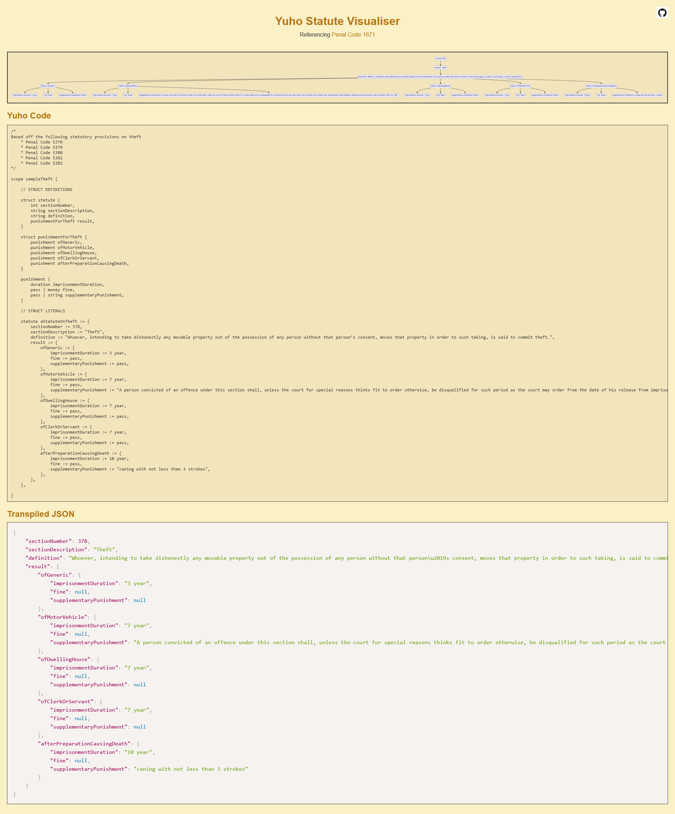

# Frontend display v1.0

> [!WARNING]
> Now deprecated.

## Organisation

* Transpiler logic can be found [here](src)
* Frontend logic can be found [here](front)

## Goals

* display evaluation of a statute *(situation -> fulfillment of predicates -> consequence)* as a flowchart
* aid understanding of statutes by
  * making key portions of a statute explicit
  * representing conditional logic clearly
  * display how different statutes relate to each other

## Screenshot



## Usage

```console
$ cd front
$ npm install -g http-server
$ http-server -p 8000
```
