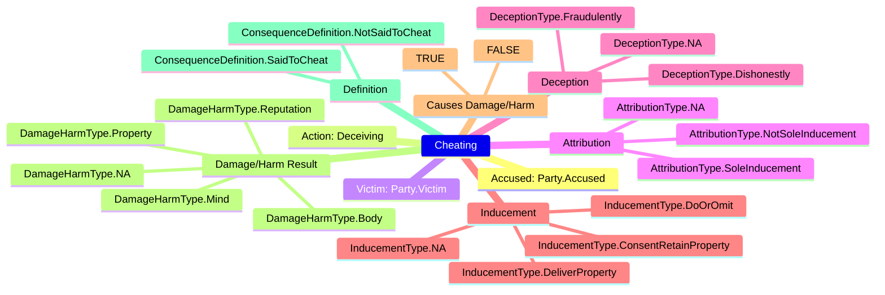
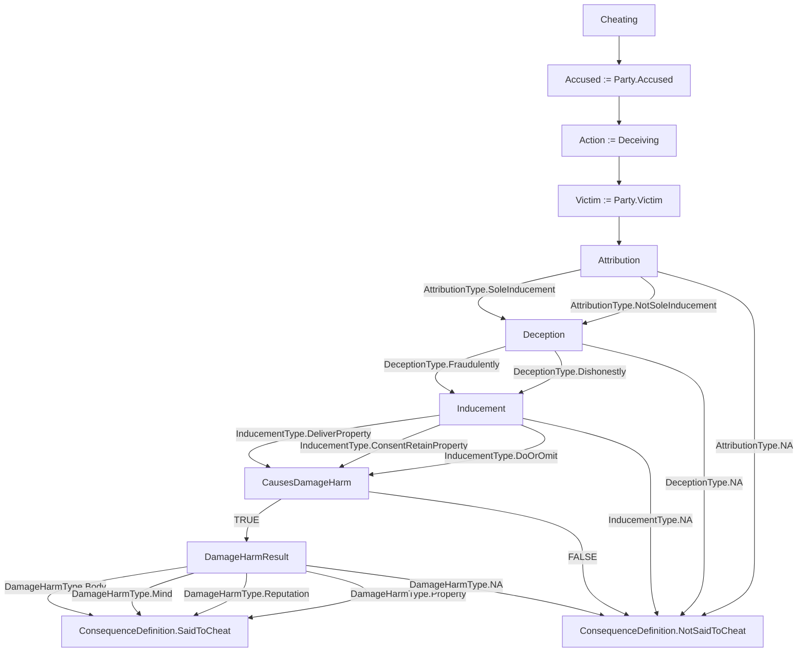
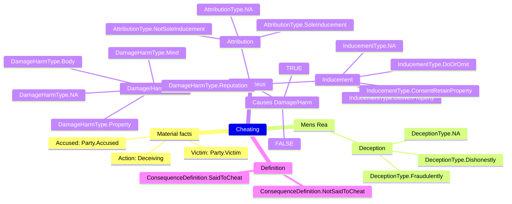
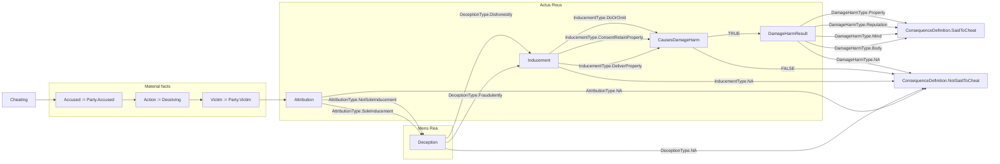

# Learn how Yuho works in 5 minutes

## Introduction


[Legalese is hard to understand](https://www.reddit.com/r/LawSchool/comments/l099fe/why_are_legal_documents_hard_to_understand_for_a/) for those unfamiliar with it.

In fact, many even argue [legal jargon is a language unto itself](https://law.stackexchange.com/questions/95218/is-legalese-a-thing-in-languages-other-than-english).

[Yuho](https://github.com/gongahkia/yuho) makes reading legalese easier to understand by reformatting and standardising the [informal logic of the law](https://plato.stanford.edu/entries/logic-informal/) into the [formal logic of mathematics and computer science](https://plato.stanford.edu/entries/logic-classical/).

Yuho is founded on the following beliefs.

1. Legalese is hard to understand
2. Textual explanations are good
3. Diagrammatic explanations are excellent

## An example

Statutes aren't always intuitive.

Below is Section 415 of the [Penal Code 1871](https://sso.agc.gov.sg/Act/PC1871) on the offense of Cheating in plaintext.

```txt
"Whoever, by deceiving any person, whether or not such deception was the sole or main inducement, fraudulently or dishonestly induces the person so deceived to deliver or cause the delivery of any property to any person, or to consent that any person shall retain any property, or intentionally induces the person so deceived to do or omit to do anything which he would not do or omit to do if he were not so deceived, and which act or omission causes or is likely to cause damage or harm to any person in body, mind, reputation or property, is said to cheat."
```

Say we attempt to break the statute into its composite elements and include indentation to represent the logical relationship between those elements. You could end up with something like this.

```txt
"Whoever, by deceiving any person,
WHETHER OR NOT such deception was the sole or main inducement,
    fraudulently OR dishonestly induces the person so deceived
        to deliver any property to any person,
        OR to consent that any person shall retain any property,
    OR intentionally induces the person so deceived
        to do
        OR omit to do anything which he would not do
        OR omit if he were not so deceived
    AND which act or omission
        causes
        OR is likely to cause
            damage
            OR harm
        to that person in body, mind, reputation, or property,
is said to cheat."
```

Still, the conditional relationship each element shares with the overall offense is not explicit.

This is where Yuho comes in.

Once someone has learnt the basics of Yuho's terse syntax, they will be able to model that same statute in Yuho as below. First, we define the types that capture each element of the offense:

```yh
// enum-like structs for each element category

struct AttributionType {
    SoleInducement,
    NotSoleInducement,
    NA,
}

struct DeceptionType {
    Fraudulently,
    Dishonestly,
    NA,
}

struct InducementType {
    DeliverProperty,
    ConsentRetainProperty,
    DoOrOmit,
    NA,
}

struct DamageHarmType {
    Body,
    Mind,
    Reputation,
    Property,
    NA,
}

// the case struct captures all relevant facts
struct CheatingCase {
    string accused,
    string victim,
    string action,
    string deceptionType,
    string inducementType,
    bool causesDamageHarm,
    string damageHarmType,
}
```

Then, we model the statute itself using Yuho's `statute` block with definitions, elements, penalty, and illustrations:

```yh
fn evaluateCheating(string deceptionType, string inducementType, bool causesDamageHarm) : string {
    match {
        case TRUE if deceptionType == "none" := consequence "Not cheating - no deception";
        case TRUE if inducementType == "none" := consequence "Not cheating - no inducement";
        case TRUE if causesDamageHarm := consequence "Said to cheat";
        case _ := consequence "Not said to cheat";
    }
}

statute 415 "Cheating" {
    definitions {
        deceive := "To cause a person to believe something that is false";
        fraudulently := "With intent to defraud another person";
        dishonestly := "With intention of causing wrongful gain or wrongful loss";
    }

    elements {
        actus_reus deception := "Deceiving any person";
        mens_rea intent := "Fraudulently or dishonestly";
        actus_reus inducement := "Inducing delivery of property, consent to retain, or act/omission";
        circumstance harm := "Causing or likely to cause damage to body, mind, reputation, or property";
    }

    penalty {
        imprisonment := 1 year .. 7 years;
        fine := $0.00 .. $50,000.00;
    }

    illustration example1 {
        "A intentionally deceives B into believing that a worthless article is valuable, and thus induces B to buy it. A cheats."
    }

    illustration example2 {
        "A falsely pretends to be in government service and induces B to let him have goods on credit. A cheats."
    }
}
```

This Yuho code can then be transpiled using the Yuho CLI (`yuho transpile`) to various representations including [Mermaid](https://mermaid.js.org/) diagrams.

Right now two primary Mermaid outputs are supported.

1. Mindmap
    * displays key elements of a statute at a glance
    * generated by parsing a struct instance


2. Flowchart
    * splays out a statute's event logic
    * generated by parsing a struct instance



Further, Yuho's flexible syntax means we can separate concepts foundational to Criminal Law, such as *Material facts*, *Mens Rea* and *Actus Reus*, by using the `elements` block inside a `statute`:

```yh
statute 415 "Cheating" {
    elements {
        // material facts
        actus_reus deception := "Deceiving any person";

        // mens rea (mental element)
        mens_rea fraudulent := "Fraudulently inducing the person";
        mens_rea dishonest := "Dishonestly inducing the person";

        // actus reus (physical element)
        actus_reus inducement := "Inducing delivery of property, consent to retain, or act/omission";
        circumstance harm := "Causing or likely to cause damage to body, mind, reputation, or property";
    }
}
```

When transpiled, these are likewise displayed in both the mindmap



and flowchart.



Moreover, we are able to visualise how a specific scenario plays out diagrammatically when holding its Yuho illustration against a Yuho statute definition as specified earlier.

Below is an illustration of [*Illustration A*](https://sso.agc.gov.sg/Act/PC1871?ProvIds=P417-#pr415-) from Section 415 of the Penal Code 1871, modelled as a struct literal:

```yh
import "penal_code/s415_cheating"

CheatingCase illustrationA := CheatingCase {
    accused := "A",
    victim := "Z",
    action := "falsely pretending to be in the Government service, intentionally deceiving",
    deceptionType := "dishonestly",
    inducementType := "ConsentRetainProperty",
    causesDamageHarm := TRUE,
    damageHarmType := "Property",
}
```

When transpiled to a Mermaid flowchart, the path that the specified illustration fulfills is highlighted.

```mermaid
flowchart TD

    subgraph flowchart2[Illustration A]
        A1[Cheating] --> B1[Accused := A]
        B1 --> C1[Action := Falsely pretending to be in Government service, intentionally deceiving]
        C1 --> D1[Victim := Z]
        D1 --> E1[Attribution := SoleInducement]
        E1 --> F1[Deception := Dishonestly]
        F1 --> G1[Inducement := ConsentRetainProperty]
        G1 --> H1[Causes Damage/Harm := TRUE]
        H1 --> I1[Damage Harm Result := Property]
        I1 --> J1[Definition := SaidToCheat]

        subgraph MaterialFacts1[Material Facts]
            B1
            C1
            D1
        end

        subgraph MensRea1[Mens Rea]
            F1
        end

        subgraph ActusReus1[Actus Reus]
           E1
           G1
           H1
           I1
        end
    end

    subgraph flowchart1[Cheating statute Definition]
        A2[Cheating] --> B2[Accused := Party.Accused]

        subgraph MaterialFacts2[Material Facts]
            B2 --> C2[Action := Deceiving]
            C2 --> D2[Victim := Party.Victim]
        end

        D2 --> E2[Attribution]
        E2 --> |AttributionType.SoleInducement| F2[Deception]
        E2 --> |AttributionType.NotSoleInducement| F2
        E2 --> |AttributionType.NA| Z

        F2 --> |DeceptionType.Fraudulently| G2[Inducement]
        F2 --> |DeceptionType.Dishonestly| G2
        F2 --> |DeceptionType.NA| Z

        subgraph MensRea2[Mens Rea]
            F2
        end

        G2 --> |InducementType.DeliverProperty| H2[CausesDamageHarm]
        G2 --> |InducementType.ConsentRetainProperty| H2
        G2 --> |InducementType.DoOrOmit| H2
        G2 --> |InducementType.NA| Z

        subgraph ActusReus2[Actus Reus]
            E2
            G2
            H2
            I2
        end

        H2 --> |TRUE| I2[DamageHarmResult]
        H2 --> |FALSE| Z[ConsequenceDefinition.NotSaidToCheat]
        I2 --> |DamageHarmType.Body| Y[ConsequenceDefinition.SaidToCheat]
        I2 --> |DamageHarmType.Mind| Y
        I2 --> |DamageHarmType.Reputation| Y
        I2 --> |DamageHarmType.Property| Y
        I2 --> |DamageHarmType.NA| Z
    end

    classDef highlightedPath fill:#77DD77,stroke:#000,stroke-width:2px,color:black;
    class A1,B1,C1,D1,E1,F1,G1,H1,I1,J1 highlightedPath;
    class A2,B2,C2,D2,E2,F2,G2,H2,I2,Y highlightedPath;
    linkStyle 0 stroke:#77DD77,stroke-width:4px;
    linkStyle 1 stroke:#77DD77,stroke-width:4px;
    linkStyle 2 stroke:#77DD77,stroke-width:4px;
    linkStyle 3 stroke:#77DD77,stroke-width:4px;
    linkStyle 4 stroke:#77DD77,stroke-width:4px;
    linkStyle 5 stroke:#77DD77,stroke-width:4px;
    linkStyle 6 stroke:#77DD77,stroke-width:4px;
    linkStyle 7 stroke:#77DD77,stroke-width:4px;
    linkStyle 8 stroke:#77DD77,stroke-width:4px;
    linkStyle 9 stroke:#77DD77,stroke-width:4px;
    linkStyle 10 stroke:#77DD77,stroke-width:4px;
    linkStyle 11 stroke:#77DD77,stroke-width:4px;
    linkStyle 12 stroke:#77DD77,stroke-width:4px;
    linkStyle 13 stroke:#77DD77,stroke-width:4px;
    linkStyle 16 stroke:#77DD77,stroke-width:4px;
    linkStyle 19 stroke:#77DD77,stroke-width:4px;
    linkStyle 28 stroke:#77DD77,stroke-width:4px;
```



## Where to go next?

* Learn Yuho's syntax at [`SYNTAX.md`](./SYNTAX.md)
* See statute examples in the [`library/`](../library/) directory
* Run formal verification with [Alloy Analyzer](https://alloytools.org/) using `yuho transpile --target alloy`
* Install and try Yuho: `pip install yuho` then run `yuho --help`
* Explore the CLI commands: `yuho check`, `yuho transpile`, `yuho explain`
* Want to contribute? See [`CONTRIBUTING.md`](../.github/CONTRIBUTING.md)
