# Architecture

## Module dependency graph

```mermaid
graph TD
    CLI[cli/main.py] --> Services[services/analysis.py]
    CLI --> Commands[cli/commands/*]
    Commands --> Services
    Commands --> Transpile[transpile/registry.py]
    Commands --> Verify[verify/combined.py]
    Commands --> LLM[llm/factory.py]
    Commands --> Eval[eval/interpreter.py]

    Services --> Parser[parser/wrapper.py]
    Services --> ASTBuilder[ast/builder.py]
    Services --> ScopeAnalysis[ast/scope_analysis.py]
    Services --> TypeInference[ast/type_inference.py]
    Services --> TypeCheck[ast/type_check.py]
    Services --> Resolver[resolver/module_resolver.py]

    Parser --> TreeSitter[tree-sitter-yuho/grammar.js]
    ASTBuilder --> Nodes[ast/nodes.py]
    ASTBuilder --> Parser

    ScopeAnalysis --> Resolver
    ScopeAnalysis --> Visitor[ast/visitor.py]
    TypeInference --> Visitor
    TypeCheck --> TypeInference
    TypeCheck --> Resolver

    Transpile --> JSON[transpile/json_transpiler.py]
    Transpile --> English[transpile/english_transpiler.py]
    Transpile --> Mermaid[transpile/mermaid_transpiler.py]
    Transpile --> LaTeX[transpile/latex_transpiler.py]
    Transpile --> Alloy[transpile/alloy_transpiler.py]
    Transpile --> GraphQL[transpile/graphql_transpiler.py]
    Transpile --> JSONLD[transpile/jsonld_transpiler.py]
    Transpile --> Blocks[transpile/blocks_transpiler.py]

    Verify --> Z3[verify/z3_solver.py]
    Verify --> AlloyV[verify/alloy.py]

    Eval --> StatuteEval[eval/statute_evaluator.py]
    Eval --> Defeasible[eval/defeasible.py]

    LSP[lsp/server.py] --> Services
    MCP[mcp/server.py] --> Services
    TUI[tui/app.py] --> CLI

    Library[library/penal_code/*] --> Resolver
```



## Directory structure

```
src/yuho/
├── ast/                 # AST nodes, builder, analysis passes
│   ├── nodes.py         # All AST node dataclasses (27k)
│   ├── builder.py       # Tree-sitter -> AST conversion (43k)
│   ├── visitor.py       # Visitor pattern base class
│   ├── scope_analysis.py # Symbol tables, import resolution
│   ├── type_inference.py # Bottom-up type inference
│   ├── type_check.py    # Type validation
│   ├── exhaustiveness.py # Match arm exhaustiveness checking
│   ├── overlap.py       # Pattern overlap detection
│   ├── reachability.py  # Dead code / unreachable detection
│   ├── constant_folder.py # Compile-time constant evaluation
│   ├── dead_code.py     # Unused definition detection
│   └── transformer.py   # AST-to-AST transformations
├── cli/                 # Click-based CLI
│   ├── main.py          # Top-level command group (25+ commands)
│   ├── commands/        # Individual command implementations
│   ├── commands_registry.py # Grouped subcommands (config, library)
│   ├── completions.py   # Shell completion generation
│   └── error_formatter.py # Colored error output
├── config/              # Configuration management
│   ├── loader.py        # TOML config loading
│   ├── schema.py        # Config schema validation
│   └── mask.py          # Error masking for user-facing output
├── eval/                # Interpreter and evaluator
│   ├── interpreter.py   # Tree-walking interpreter (29k)
│   ├── statute_evaluator.py # Statute element satisfaction checking
│   └── defeasible.py    # Exception/defence defeat logic
├── library/             # Package management
│   ├── index.py         # Library index/search
│   ├── install.py       # Package installation
│   ├── lockfile.py      # Lock file management
│   ├── package.py       # Package metadata
│   ├── resolver.py      # Dependency resolution
│   └── signature.py     # Package signing/verification
├── llm/                 # LLM integration
│   ├── providers.py     # Ollama, HuggingFace, OpenAI, Anthropic
│   ├── config.py        # LLM configuration
│   ├── factory.py       # Provider factory
│   ├── prompts.py       # Prompt templates
│   └── utils.py         # Shared utilities
├── lsp/                 # Language Server Protocol
│   ├── server.py        # pygls-based LSP server
│   ├── diagnostics.py   # Error/warning diagnostics
│   ├── completion_handler.py # Autocomplete
│   ├── hover_handler.py # Hover info
│   └── code_action_handler.py # Quick fixes
├── mcp/                 # Model Context Protocol server
│   └── server.py        # MCP tool definitions
├── parser/              # Tree-sitter parser wrapper
│   ├── wrapper.py       # Parse API, error extraction
│   └── source_location.py # Source location tracking
├── resolver/            # Module resolution
│   └── module_resolver.py # Import/reference resolution with caching
├── services/            # Shared service layer
│   ├── analysis.py      # End-to-end parse+AST+semantic pipeline
│   └── errors.py        # Boundary error types
├── testing/             # Test infrastructure
│   ├── coverage.py      # Element coverage tracking
│   └── fixtures.py      # Test fixtures
├── transpile/           # Transpiler framework
│   ├── base.py          # TranspilerBase ABC + TranspileTarget enum
│   ├── registry.py      # Singleton transpiler registry
│   └── *_transpiler.py  # 8 transpiler implementations
├── tui/                 # Terminal UI (Textual)
│   ├── app.py           # Main TUI application
│   └── ascii_art.py     # ASCII art assets
└── verify/              # Formal verification
    ├── combined.py      # Combined Z3+Alloy runner
    ├── z3_solver.py     # Z3 constraint generation (60k)
    └── alloy.py         # Alloy model generation (22k)
```

## Data flow

```
.yh source
    │
    ▼
tree-sitter parse  →  CST (concrete syntax tree)
    │
    ▼
ASTBuilder.build() →  ModuleNode (AST)
    │
    ├─→ ScopeAnalysis (+ ModuleResolver for imports)
    ├─→ TypeInference
    ├─→ TypeCheck
    │
    ▼
Transpilers (JSON, English, Mermaid, LaTeX, Alloy, GraphQL, JSON-LD, Blocks)
Interpreter (evaluation, assertion testing)
Verifiers (Z3, Alloy formal verification)
```

## Adding a new transpiler

1. Create `src/yuho/transpile/my_transpiler.py`
2. Subclass `TranspilerBase` from `base.py`
3. Implement `transpile(self, ast: ModuleNode) -> str`
4. Add target to `TranspileTarget` enum in `base.py`
5. Register in `registry.py:_register_builtins()`
6. Add CLI choice in `main.py` transpile command's `--target` option

See `json_transpiler.py` for a minimal example.

## Adding a new CLI command

1. Create `src/yuho/cli/commands/my_command.py` with `run_my_command()` function
2. Add `@cli.command()` in `main.py` (for top-level) or in `commands_registry.py` (for grouped)
3. Use lazy imports: `from yuho.cli.commands.my_command import run_my_command`

## Grammar changes

1. Edit `src/tree-sitter-yuho/grammar.js`
2. Run `cd src/tree-sitter-yuho && tree-sitter generate`
3. Update `src/yuho/ast/builder.py` to handle new node types
4. Update `src/yuho/ast/nodes.py` if new AST node types are needed
5. Run tests: `pytest tests/`
