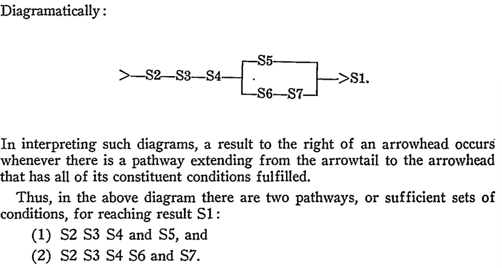
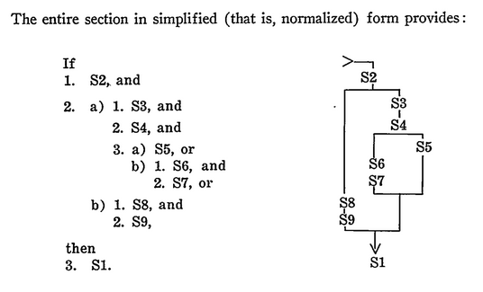
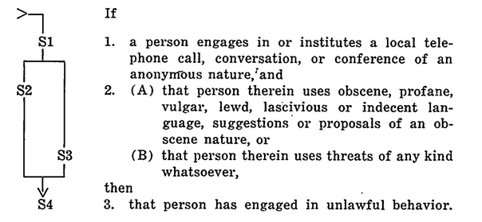
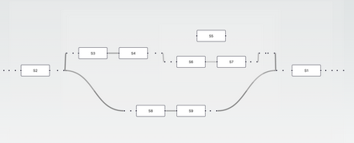
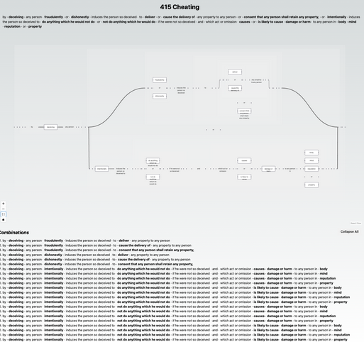
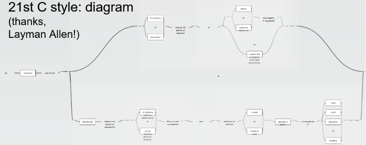

# Yuho v3.0 Kanban Board

Things being worked on.

## Backlog 🔙

### 1. Syntax

1. Edit SYNTAX.md and fully brainstorm complete set of keywords for Yuho
    1. Possible keywords
        1. AND, OR, NOT, CAUSE, ()
        2. TEST, REQUIRE
        3. IF, ELSE, ELSEIF, IF AND ONLY IF, OR, XOR
        4. RULING, PRECEDENT, DERIVE, ORIGINATE, INHERIT
        6. ALL, NONE, ONE, MORE THAN ONE, ZERO
        7. ACT, POLICY, REFERENCE, PER, LEGISLATION, INCLUSIVE IF, EXCLUSIVE IF, CASE, STATUTE
        8. OBITER, RATIO, FROM, PRIMARY, SUBSIDIARY 
        9. LEGAL, ILLEGAL
        10. WRONGFUL, RIGHTFUL
            1. subdivisions of WRONGFUL and RIGHTFUL
            2. eg. WRONGFUL: CONTRADICTION or WRONGFUL: CAUSATION_ERROR are possible error messages
        11. SHALL, MUST
            1. DSLs need to account for the nuances between SHALL and MUST
            2. What is a necessary compulsary consequence and what is a possible consequence?
    2. See [L4 syntax](https://github.com/smucclaw/lam4)
    3. See [Catala's syntax](https://github.com/CatalaLang)
    4. See [Blawx](https://github.com/Lexpedite/blawx)
2. Syntax must be 
    1. simple to learn and write
    2. simple to read
    3. easy to tokenise, parse and interpret
    4. be able to represent common law rulings and statutes
    5. general enough to represent both criminal law and tort, as well as common law rulings
    6. able to define a given term or idea recursively
    7. all keywords are CAPITALISED by default for ease of reading
        1. "Normalisation" results in documents that are faster and more accurate to read and understand 
    8. all keywords should aim to be familar to lawyers and the layperson and not too technical to avoid a steep learning curve
    9. account for subsidiary legislation as well and distinguish it from primary legislation
3. Language inspirations
    1. Python
    2. Julia
    3. Nim

### 2. Logic engine

1. Implement the Espresso-IISOJS npm libarry for heuristic minimiation of single-output boolean functions myself in python or whatever language I choose to write this in, probably just use Python for simplicity
1. Can represent everything as truth values first
2. Can evaluate those truth values
3. Handles
    1. Boolean minimization
        1. As applied in *Poh Yuan Nie v Public Prosecutor [2022] SGCA 74* in Meng's presentation to me on 13/09/24
        2. A more complex statement should evaluate to a less complex one
            1. eg. `"Driving while intoxicated" IS NOT NOT NOT NOT NOT AN OFFENCE` = `"Driving while intoxicated" IS AN OFFENCE`
            2. eg. `"Entering the premises without permission" IF AND ONLY IF "breaking a window"` = `"Breaking a window" -> "Entering the premises without permission"`
            3. eg. `"Carrying a concealed weapon" AND "Committing theft" IS AN OFFENCE` = `"Committing theft" IS AN OFFENCE` and `"Carrying a concealed weapon" IS AN OFFENCE` 
            4. eg. `"Selling prohibited substances" IS AN OFFENCE AND IS NOT AN OFFENCE` == CONTRADICTION and will be flagged
            5. eg. `NOT "Assaulting a police officer" IF AND ONLY IF "Acting in self-defense"` = `"Acting in self-defense" -> NOT "Assaulting a police officer"`
    2. Contradiction flagging
    3. Variable substitution
        1. `(A and B) or (C and D and E)`, assuming we define `E in terms of C` which looks like `E = ! C` = `(A and B) or (C and D and not C)`
        2. now imagine E is "property" and C is defined as what is NOT property OR property's actual definition
        3. also this has a contradiction inside!
        4. simplification of boolean circuits is super relevant because it means we don't even need to waste resources validating D
        5. this means we have dropped from 5 cardinals to 2 cardinals
        6. also implement recursive definitions that will render the evaluation of statutes easier 
            1. eg. cheating s415 has the word dishonestly, wrongful gain and wrongful loss, defined in s23 and 24 respectively
    4. eliminating logic redundancy
    5. ignoring don't care terms and can't happen terms
4. Allows for expressing statutes in terms of formal logic
    1. Per *Normalized legal drafting and the query method*
    2. Elimination of contradiction
    3. Simplification of complex legalese
    4. Simplification of nonsensical obiter and ratio
5. Can dynamically generate a truth table from specified truth values and their relationships in any propositional formula presented
    1. TRUTH VALUES are replaced by statutes and its subdivisions
6. Flags logical contradictions and fallacies
7. Validates whether a given statement is logically coherent or not
8. look into SAT solving and other formal methods to identify logical fallacies and issues with logic
9. logic engine should be able to 
    1. evaluate basic propositional formulas
    2. handle basic inconsitency checking 
    3. accelerate testing facilities for DSLs

### 3. Code examples

1. Add all examples of sample Yuho code in the ./example file directory, 
2. Represent the Spandeck test in Yuho for tort duty of care *(type of harm, threshold requirement and 2 stages of proximity and public policy considerations)*
3. Represent old UK tests in Yuho for tort duty of care
4. Add focus on whether the relationship shared between kinds of harm caused 
5. Could the transpiler generate a degree_of_liability represented as a float?
6. Interlinks between statutes
    1. Complex provisions have terms like “subject to” that logically connect different sections or entire statutes *(by way of providing explanation or exception for a given rule or term)*
    2. Provide an example of how Yuho can represent 2 statutes interacting
    3. Or remove this entire follow up action Or move it to FUTURE.md

### 4. Tokenisor, Parser, Interpreter

1. Add the logic for the tokenisor, parser and interpreter in ./src file directory

### 5. Tests

1. Add proper tests that are runnable within Alloy or find another framework to run tests in

### 6. Transpiler

1. Brainstorm transpilation outputs for Yuho
2. Diagrammatic outputs
    1. Mermaid diagrams, primarily with flowcharts
    2. [Ladder diagrams](https://github.com/smucclaw/ladder-diagram) 
    3. ASCII diagrams
    4. PLANTUML diagrams
    5. graphviz
    6. [kroki](https://kroki.io/) 
    7. d2
    8. [tonto](https://github.com/matheuslenke/Tonto)
    9. [enso](https://github.com/enso-org/enso)
3. Textual outputs
    1. ...
4. Programatic outputs
    1. ...
5. purpose of this would be to 
    1. convert ambigious within-sentence syntax into an unambigious between-sentence syntax
    2. disambiguiting the relevant aspects of within-sentence syntax

### 7. Web frontend

1. a frontend web display 
2. see Wong Meng Weng's [react application]() that shows the multiple pathways that are possible 
3. INCLUDE a similar field below *(generated dynamically by traversing all paths one can take)* that shows ALL POSSIBLE paths that the reading of a given statute can take as seen below
4. Diagrammatic representation should show ALL possible permutations of a given offence 
    1. These permutations can then be checked against a specified situation to determine applicability
5. Diagrammatic representation could also include the given Yuho code for a specified situation
6. DSL diagrammatic representations should be able to account for base assumptions that are implicit within the law
    1. which court can hear a given case?
    2. which jurisdiction a case can be heard in?
    3. what constitutes a person per the specific act?
    4. eg. in s415, the act would not apply for those who are not singaporeans, can we edit the diagrammatic representation to account for that?
        1. end goal of making what is implicit explicit
        2. perhaps could consider making these implicit assumptions explicit by specifying them as preconditions within the list of all permutations
7. Still lacking diagrammatic representation that can reflect that a given statute is contingent on another statute, brainstorm how to reflect that in the web frontend

### 8. README.md

1. Edit README.md to more accurately reflect Yuho's purpose
2. Include an ASCII architecture diagram 
3. Include a mermaid architecture diagram
4. Benefits of a DSL is that code makes all things explicit while the law features many assumptions that are implicit
5. Yuho as a DSL benefits from the law as code mindset by rendering these assumptions in detail
6. Yuho's usecases
    1. purpose would be for law students to identify defective logic, charges and rulings when applying statutes
    2. purpose would be for lawyers, lawmakers and drafters to avoid wasting precious court time rationalilising or applying obiter and judgements that make little sense
67. Research
    1. research cannons of interpretation and construction in law and those that are relevant for the implementation of DSLs and heuristic minimalisation 
    2. eg.
        1. harmonious construction
        2. rule against surplusage
        3. etc...

### 9. CLI tools

1. Create a suite of Yuho CLI tools
2. Make them easy to install, learn and use
3. References for decent CLI tools
    1. Rust Cargo
    2. Python Pip
    3. FZF
    4. Git

## Doing ✍️

1. 

## Review 🗳️

1. 

## Done 👏

1. 
