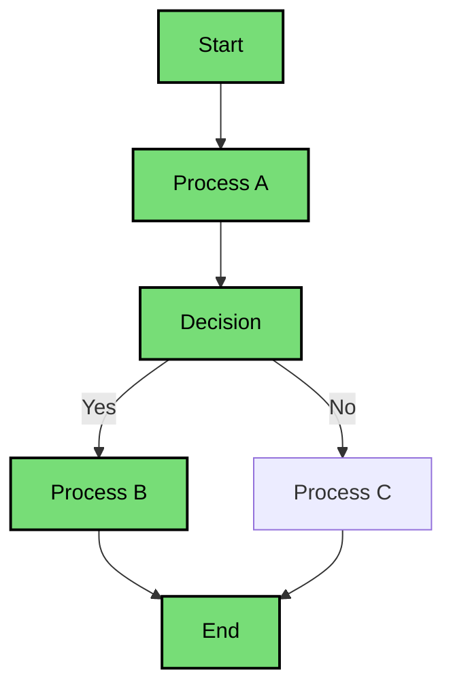

# Future plans

## Follow Up Actions

### Immediate 

* Create a tool that can compile a base struct definition file and an instance of a struct literal file of a given illustration / situation and highlight that path in a Mermaid flowchart, perhaps with a clicking through and rerendering the mermaid diagram each time while appending a new named node to the class
    * Brainstorm all possible mermaid diagrams that can be created based on the illustration struct instances
    * Example of a highlighted path is as below
    * Maybe have a sidebar showing what each step fulfilled is like to achieve that highlighted path *(assuming click-through functionality is present)*

* Add a live editor if possible that transpiles yuho code live by running a script in the backend and rerenders the mermaid diagram everytime
    * Implement this in svelteflow for extra points
* Apply the following changes made to *Cheating* to all other examples as well!
* Proposed workflow for [`src`](./../src) code
    1. enforce Yuho's syntax by reading `.yh` files and checking whether a struct instance conforms to its struct definition laid out
        * add a reminder in the LSP whenever an enum is detected to not end with an `NA` option 
        * linting as needed
    2. transpile `.yh` code to `.mmd` for diagramtic representations by reading **valid struct instances**, see `./../test_frontend/` and continue working on the code for that
* Add Yuho CLI tools in Svelte or Rust to run checks similar to Rust Cargo that 
    * make it easy to START writing a Yuho struct in a `.yh` file
    * check the validity of a Yuho file ending in the file extension `.yh`
    * transpile the `.yh` file to a `.mmd` file that provides either a Mindmap or Flowchart
    * tool that affords dynamic generation of struct instances / tests as legible examples for lawyers to use based upon the *Illustrations* section of a given definition statute (again, see S415 on Cheating)
    * think of a funny name for the CLI tool like *junior_lawywer* *(in the spirit of Catala's `clerk`)*
* Currently rescope Yuho to focus on accurately representing **definition sections** within the Penal Code (s415 for cheating) under [`s415_cheating_definition.yh`](./../example/s415_cheating_definition.yh)
    * change the base README.md to reflect this shift

### Later

1. Checks under `./test`
    * right now only checking for syntax and enforcing basic conditional constructs
    * add files to dynamically generate tests for different statutes
    * integrate LLMs that are fed sanitised struct to see whether Yuho's internal logic and struct validity can be 'tested'
        * consider whether to use encoder/decoder or transformer model, see other avail options

2. Appealing UI/UX
    * intuitive controls so lawyers and law students *(no programming proficiency required)*
    * "right now you're showing how the sausage is made *(the nerdy programmer shit)*"
    * pitching Yuho to lawyers requires an easy to **access** and **use** frontend interface
    * provide 2 frontend products
        1. live editor for Yuho code that updates the mermaid diagram
            * see [L4 IDE](https://smucclaw.github.io/l4-lp/) for live editor that allows updating of diagrams
            * in terms of functionality and ease of use, see L4's approach via a [Google Sheets Extension](https://l4-documentation.readthedocs.io/en/latest/docs/quickstart-installation.html#getting-the-legalss-spreadsheet-working-on-your-computer) 
        2. scratch-like controls with drag and drop interface so different logical blocks can be rearranged and the struct updates live
            * is there a HTML element / Svelte frontend that can achieve the same flow-chart like Display without relying on Mermaid? *(ideally I would want HMR)*
            * see [Svelteflow](https://svelteflow.dev/) for reactive diagrams and flowcharts
        * retain the flowchart-style display to show all logical outcomes of a given offence as defined by the statute
        * add user input method that allows 'stepping-through' the flowchart for a given charge / **highlight** the logical path for A --> B, useful especially if the flowchart is very complex and nested
            * see [Whyline](https://www.cs.cmu.edu/~NatProg/whyline.html) for dynamic sites that display logical evaluation of a given decision
                * application in Yuho front-end
                    * allows users to ask "Why did" and "Why didn't" questions about a given output
                    * users choose from a set of questions generated automatically via static and dynamic analyses, and the tool provides answers in terms of the runtime events that caused or prevented the desired output
        * see [Enso](https://github.com/enso-org/enso/tree/develop?tab=readme-ov-file) for dynamic sites that provide accurate intuitive modelling of why a given statute operates the way it does
        * see [Tonto](https://matheuslenke.github.io/tonto-docs/) for how it models conceptual models textually
        * see [D2](https://github.com/terrastruct/d2) for a diagramming language as easy to read as markdown and mermaid

3. Comprehensive 
    * find edgecases Prof Alexandar Woon was talking about within the Penal Code *(generated by the amendments or not)*

4. Rework the following files per the new changes
    * `./README.md` for updates to Yuho's usage and status under > [IMPORTANT!]
    * `./doc/syntax.md` for updates to Yuho's syntax
    * `./example/sample*.yh` for updates to all Yuho example files with the updated syntax
    * `./grammer/` for updates to all files regarding Yuho's new grammer and syntax
    * `./src/main/` for updates to all files recursively *(`-r`)* within all folders in `./src` regarding changes to Yuho's syntax
    * `./src/seconday/` for updates to all Yuho transpilers for Yuho's new syntax
    * `./web/src` for updates to all files like `trans_*.py` regrading transpilation to Yuho's new syntax
    * `./web/dep/*` for updates to all files recursively within all folders in `./web/dep` regarding chanegs to Yuho's validated examples of how Yuho code is meant to look
    * `./web/front/index.html` for updates to the transpiled HTML frontend code
    * `./lsp/` for a complete rehaul of Yuho's LSP and to provide IDE-style syntax highlighting for any IDE I want Yuho to be supported in

5. Account for the *Explanations* under every section (*eg.* s415)
    * Add a new syntax keyword OR define a struct attribute under an existing struct to include these *Explanations* sections
    * Do I want to break down the terms and logic within these sections also?
    * Consider how these *Explanations* would be rendered on the existing Mindmap and Flowchart representations in mermaid

6. Future scope
    * expand Yuho's scope to cover **both** definition **and** the consequence punishment application sections (s416 - s420)
    * see how to represent them within `.yh` code first, include those in the `./examples/` folder
    * then determine what their transpiled output and diagramatic representation in `.mmd` would look like
    * identify common UNIQUE attributes shared by s416-s420 *(consequence punishment application sections)*
    * incorporate conditional logic (like AND OR) into those attributes and make as granular as possible
        * What other elements of a statute can I break up and specify logic within?
    * rethink Yuho's syntax to be more specific toward Criminal Law *(examine statutes within the Penal Code, what should we be representing?)*
    * can I represent detailed evaluation of a struct instance that includes BOTH the base definition *(eg. s415)* AND its detailed applications *(eg. s416-420)* within the same flowchart?

7. More development on fault element, physical element, defences
    * Further integrate the composite elements of Actus reus and Mens rea into Yuho's syntax and diagramatic representation?
        * Fault element
            * INTENTION
            * KNOWLEDGE
            * RASHNESS
            * NEGLIGENCE
        * Physical element
            * CAUSATION
            * CONCURRENCE
            * AUTOMATISM
            * ILLEGAL OMISSION
    * Include general and specific defences?
       * Shelve discussion of defences for now and add it below to future.md as additional thing to consider but inconsequential since statutes by default don't specify the defences of an offence
       * Perhaps can include it within the flowchart
    * Refer to Criminal Law notes google doc from Azfir's structure of inquiry as required

## Feedback

### 030824

* Prof Alexander Woon
    * Yuho presupposes a consistent structure across the whole penal code, which might be a misplaced assumption
    * Penal Code 1871 but many amendments have since been made, creating inconsistencies within the format of how the whole Penal Code is structured
    * Cheating provision in particular is very complicated
    * How can you more robustly represent the Penal Code?

* Eugene
    * L4 focuses on so many areas that their language design has to account for too many things 
    * Advantage is that Yuho can afford to be **more granular** in it's representation of even one statute, so focus on that first
    * How deep can Yuho go in representing statutes that can differentiate Yuho from other DSLs? 

* Lucas
    * Don't be discouraged
