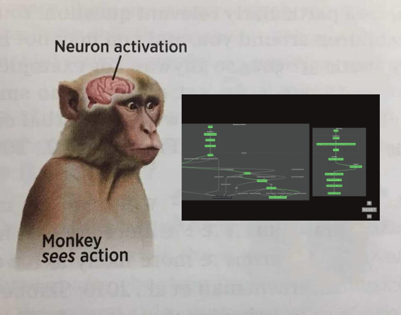
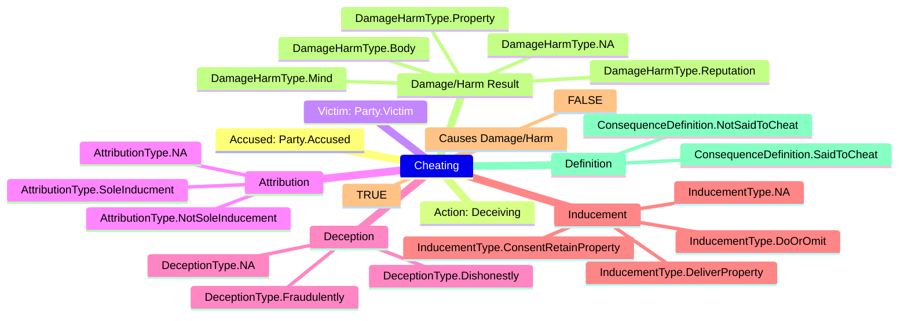
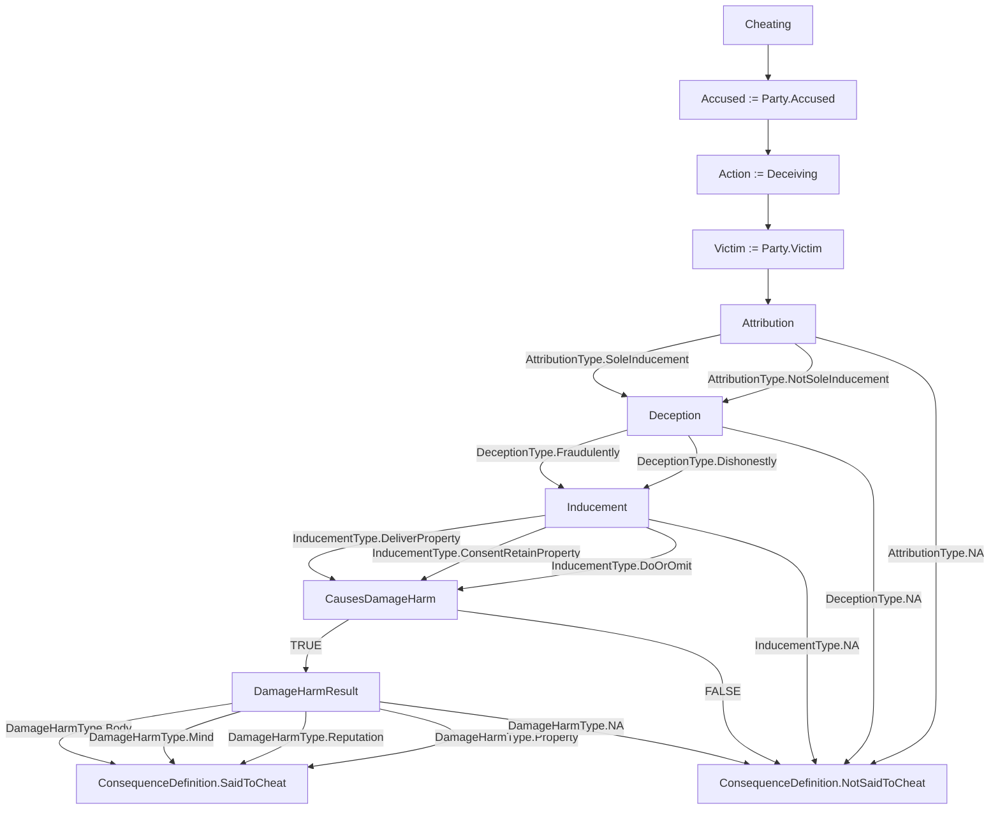
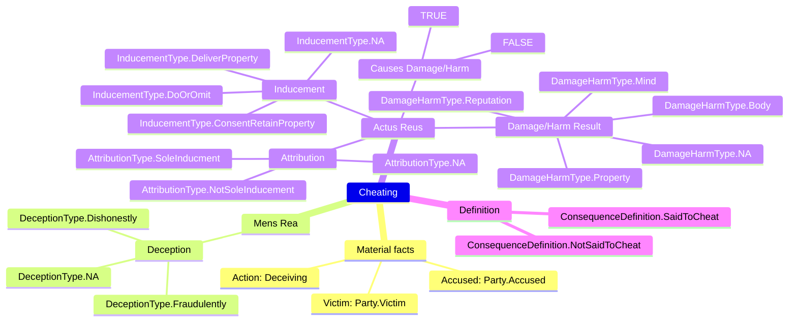
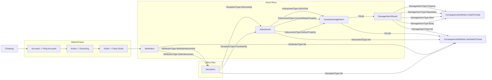

# Learn how Yuho works in 5 minutes



## Introduction

Yuho was born from the following beliefs.

1. Legalese is hard to understand
2. Textual explanations are good
3. Diagrammatic explanations are excellent

## An example

Statutes aren't always intuitive.  

Below is Section 415 of the [Penal Code 1871](https://sso.agc.gov.sg/Act/PC1871) on the offense of Cheating in plaintext.

```txt
"Whoever, by deceiving any person, whether or not such deception was the sole or main inducement, fraudulently or dishonestly induces the person so deceived to deliver or cause the delivery of any property to any person, or to consent that any person shall retain any property, or intentionally induces the person so deceived to do or omit to do anything which he would not do or omit to do if he were not so deceived, and which act or omission causes or is likely to cause damage or harm to any person in body, mind, reputation or property, is said to cheat."
```

Say we attempt to break the statute into its composite elements and include indentation to represent the logical relationship between those elements. You could end up with something like this.

```txt
"Whoever, by deceiving any person, 
WHETHER OR NOT such deception was the sole or main inducement,
    fraudulently OR dishonestly induces the person so deceived
        to deliver any property to any person,
        OR to consent that any person shall retain any property,
    OR intentionally induces the person so deceived
        to do
        OR omit to do anything which he would not do
        OR omit if he were not so deceived
    AND which act or omission
        causes
        OR is likely to cause
            damage
            OR harm
        to that person in body, mind, reputation, or property,
is said to cheat."
```

Still, the conditional relationship each element shares with the overall offense is not explicit.  

This is where Yuho comes in.  

Once someone has learnt the basics of Yuho's terse syntax, they will be able to structure that same statute in Yuho as below.

```yh
scope s415CheatingDefinition {

    struct Party { 
        Accused,
        Victim,
    }

    struct AttributionType { 
        SoleInducment,
        NotSoleInducement,
        NA,
    }

    struct DeceptionType { 
        Fraudulently,
        Dishonestly,
        NA,
    }

    struct InducementType { 
        DeliverProperty,
        ConsentRetainProperty,
        DoOrOmit,
        NA,
    }

    struct DamageHarmType { 
        Body,
        Mind, 
        Reputation,
        Property,
        NA,
    }

    struct ConsequenceDefinition { 
        SaidToCheat,
        NotSaidToCheat,
    }

    struct Cheating { 
        string || Party accused,
        string action,
        string || Party victim,
        AttributionType attribution,
        DeceptionType deception,
        InducementType inducement,
        boolean causesDamageHarm,
        {DamageHarmType} || DamageHarmType damageHarmResult, 
        ConsequenceDefinition definition,
    }

    Cheating cheatingDefinition := { 

        accused := Party.Accused,
        action := "deceiving",
        victim := Party.Victim,
        attribution := AttributionType.SoleInducment or AttributionType.NotSoleInducement or AttributionType.NA,
        deception := DeceptionType.Fraudulently or DeceptionType.Dishonestly or DeceptionType.NA,
        inducement := InducementType.DeliverProperty or InducementType.ConsentRetainProperty or InducementType.DoOrOmit or InducementType.NA, 
        causesDamageHarm := TRUE or FALSE,
        damageHarmResult := {
            DamageHarmType.Body,
            DamageHarmType.Mind,
            DamageHarmType.Reputation,
            DamageHarmType.Property,
        } or DamageHarmType.NA, 

        definition := match attribution {
            case AttributionType.SoleInducment := deception
            case AttributionType.NotSoleInducement := deception
            case AttributionType.NA := consequence ConsequenceDefinition.NotSaidToCheat
        },
        definition := match deception {
            case DeceptionType.Fraudulently := consequence inducement
            case DeceptionType.Dishonestly := consequence inducement
            case DeceptionType.NA := consequence ConsequenceDefinition.NotSaidToCheat
        },
        definition := match inducement {
            case InducementType.DeliverProperty := consequence causesDamageHarm
            case InducementType.ConsentRetainProperty := consequence causesDamageHarm
            case InducementType.DoOrOmit := consequence causesDamageHarm
            case InducementType.NA := consequence ConsequenceDefinition.NotSaidToCheat
        },
        definition := match causesDamageHarm {
            case TRUE := consequence damageHarmResult
            case FALSE := consequence ConsequenceDefinition.NotSaidToCheat
        },
        definition := match {
            case DamageHarmType.NA in damageHarmResult := consequence ConsequenceDefinition.NotSaidToCheat
            case _ :=  consequence ConsequenceDefinition.SaidToCheat 
        },

    }

}
```

This Yuho code can then be [transpiled](./../../src/main/) to various diagrammatic representations in [Mermaid](https://mermaid.js.org/).  

Right now two primary Mermaid outputs are supported.  

1. Mindmap
    * displays key elements of a statute at a glance
    * generated by parsing a struct instance


2. Flowchart
    * splays out a statute's event logic
    * generated by parsing a struct instance



Further, Yuho's flexible syntax means we can seperate concepts foundational to Criminal Law, such as *Material facts*, *Mens Rea* and *Actus Reus*.  

```yh
scope s415DetailedCheatingDefinition {

    struct Party {
        Accused,
        Victim,
    }

    struct AttributionType {
        SoleInducment,
        NotSoleInducement,
        NA,
    }

    struct DeceptionType {
        Fraudulently,
        Dishonestly,
        NA,
    }

    struct InducementType {
        DeliverProperty,
        ConsentRetainProperty,
        DoOrOmit,
        NA,
    }

    struct DamageHarmType {
        Body,
        Mind, 
        Reputation,
        Property,
        NA,
    }

    struct ConsequenceDefinition {
        SaidToCheat,
        NotSaidToCheat,
    }

    struct Facts {
        string || Party accused,
        string action,
        string || Party victim,
    }

    struct MentalElement {
        DeceptionType deception,
    }

    struct PhysicalElement {
        AttributionType attribution,
        InducementType inducement,
        boolean causesDamageHarm,
        {DamageHarmType} || DamageHarmType damageHarmResult, 
    }

    struct Cheating {
        Facts materialFacts,
        MentalElement mensRea,
        PhysicalElement actusReus,
        ConsequenceDefinition definition,
    }

    Cheating cheatingDefinition := { 

        materialFacts := {
            accused := Party.Accused,
            action := "deceiving",
            victim := Party.Victim,
        },
        mensRea := {
            deception := DeceptionType.Fraudulently or DeceptionType.Dishonestly or DeceptionType.NA,
        },
        actusReus := {
            attribution := AttributionType.SoleInducment or AttributionType.NotSoleInducement or AttributionType.NA,
            inducement := InducementType.DeliverProperty or InducementType.ConsentRetainProperty or InducementType.DoOrOmit or InducementType.NA, 
            causesDamageHarm := TRUE or FALSE,
            damageHarmResult := {
                DamageHarmType.Body,
                DamageHarmType.Mind,
                DamageHarmType.Reputation,
                DamageHarmType.Property,
            } or DamageHarmType.NA, 
        },

        definition := match attribution {
            case AttributionType.SoleInducment := deception
            case AttributionType.NotSoleInducement := deception
            case AttributionType.NA := consequence ConsequenceDefinition.NotSaidToCheat
        },
        definition := match deception {
            case DeceptionType.Fraudulently := consequence inducement
            case DeceptionType.Dishonestly := consequence inducement
            case DeceptionType.NA := consequence ConsequenceDefinition.NotSaidToCheat
        },
        definition := match inducement {
            case InducementType.DeliverProperty := consequence causesDamageHarm
            case InducementType.ConsentRetainProperty := consequence causesDamageHarm
            case InducementType.DoOrOmit := consequence causesDamageHarm
            case InducementType.NA := consequence ConsequenceDefinition.NotSaidToCheat
        },
        definition := match causesDamageHarm{
            case TRUE := consequence damageHarmResult
            case FALSE := consequence ConsequenceDefinition.NotSaidToCheat
        },
        definition := match {
            case DamageHarmType.NA in damageHarmResult := consequence ConsequenceDefinition.NotSaidToCheat
            case _ :=  consequence ConsequenceDefinition.SaidToCheat 
        },

    }

}
```

When transpiled, these are likewise displayed in both the mindmap    



and flowchart.



Moreover, we are able to visualise how a specific scenario plays out diagramatically when holding its Yuho statute literal against a Yuho statute definition as specified earlier.  

Below is a Yuho statute literal of [*Illustration A*](https://sso.agc.gov.sg/Act/PC1871?ProvIds=P417-#pr415-) from Section 415 of the Penal Code 1871. 

```yh
referencing Cheating from s415_cheating_definition

s415_cheating_definition.Cheating cheatingIllustrationA := { 

    accused := "A",
    action := "falsely pretending to be in the Government service, intentionally deceiving",
    victim := "Z",
    attribution := AttributionType.SoleInducment, 
    deception := DeceptionType.Dishonestly, 
    inducement := InducementType.ConsentRetainProperty,
    causesDamageHarm := TRUE, 
    damageHarmResult := DamageHarmType.Property,
    definition := ConsequenceDefinition.SaidToCheat,

}
```

When transpiled to a Mermaid flowchart, the path that the specified Yuho statute literal fulfills is highlighted.  

```mermaid
flowchart TD

    subgraph flowchart2[Illustration A]
        A1[Cheating] --> B1[Accused := A]
        B1 --> C1[Action := Falsely pretending to be in Government service, intentionally deceiving]
        C1 --> D1[Victim := Z]
        D1 --> E1[Attribution := SoleInducement]
        E1 --> F1[Deception := Dishonestly]
        F1 --> G1[Inducement := ConsentRetainProperty]
        G1 --> H1[Causes Damage/Harm := TRUE]
        H1 --> I1[Damage Harm Result := Property]
        I1 --> J1[Definition := SaidToCheat]

        subgraph MaterialFacts1[Material Facts]
            B1
            C1
            D1
        end

        subgraph MensRea1[Mens Rea]
            F1
        end

        subgraph ActusReus1[Actus Reus]
           E1
           G1
           H1
           I1 
        end
    end

    subgraph flowchart1[Cheating statute Definition]
        A2[Cheating] --> B2[Accused := Party.Accused]
        
        subgraph MaterialFacts2[Material Facts]
            B2 --> C2[Action := Deceiving] 
            C2 --> D2[Victim := Party.Victim]
        end
        
        D2 --> E2[Attribution]
        E2 --> |AttributionType.SoleInducement| F2[Deception]
        E2 --> |AttributionType.NotSoleInducement| F2
        E2 --> |AttributionType.NA| Z
        
        F2 --> |DeceptionType.Fraudulently| G2[Inducement] 
        F2 --> |DeceptionType.Dishonestly| G2
        F2 --> |DeceptionType.NA| Z
        
        subgraph MensRea2[Mens Rea]
            F2
        end
        
        G2 --> |InducementType.DeliverProperty| H2[CausesDamageHarm]
        G2 --> |InducementType.ConsentRetainProperty| H2
        G2 --> |InducementType.DoOrOmit| H2
        G2 --> |InducementType.NA| Z
        
        subgraph ActusReus2[Actus Reus]
            E2
            G2
            H2
            I2
        end
        
        H2 --> |TRUE| I2[DamageHarmResult]
        H2 --> |FALSE| Z[ConsequenceDefinition.NotSaidToCheat]
        I2 --> |DamageHarmType.Body| Y[ConsequenceDefinition.SaidToCheat]
        I2 --> |DamageHarmType.Mind| Y
        I2 --> |DamageHarmType.Reputation| Y
        I2 --> |DamageHarmType.Property| Y
        I2 --> |DamageHarmType.NA| Z
    end

    classDef highlightedPath fill:#77DD77,stroke:#000,stroke-width:2px,color:black;
    class A1,B1,C1,D1,E1,F1,G1,H1,I1,J1 highlightedPath;
    class A2,B2,C2,D2,E2,F2,G2,H2,I2,Y highlightedPath;
    linkStyle 0 stroke:#77DD77,stroke-width:4px;
    linkStyle 1 stroke:#77DD77,stroke-width:4px;
    linkStyle 2 stroke:#77DD77,stroke-width:4px;
    linkStyle 3 stroke:#77DD77,stroke-width:4px;
    linkStyle 4 stroke:#77DD77,stroke-width:4px;
    linkStyle 5 stroke:#77DD77,stroke-width:4px;
    linkStyle 6 stroke:#77DD77,stroke-width:4px;
    linkStyle 7 stroke:#77DD77,stroke-width:4px;
    linkStyle 8 stroke:#77DD77,stroke-width:4px;
    linkStyle 9 stroke:#77DD77,stroke-width:4px;
    linkStyle 10 stroke:#77DD77,stroke-width:4px;
    linkStyle 11 stroke:#77DD77,stroke-width:4px;
    linkStyle 12 stroke:#77DD77,stroke-width:4px;
    linkStyle 13 stroke:#77DD77,stroke-width:4px;
    linkStyle 16 stroke:#77DD77,stroke-width:4px;
    linkStyle 19 stroke:#77DD77,stroke-width:4px;
    linkStyle 28 stroke:#77DD77,stroke-width:4px;
```



## Where to go next?

* Learn Yuho's syntax at [`syntax.md`](./syntax.md)
* See other examples of Yuho at [`./example/`](./example/)
* Run Yuho's syntax through formal specifications with [Alloy Analyzer](https://alloytools.org/) at [`./tests/main`](./../../tests/main)
* Try Yuho out for yourself at [`./src/main/`](./../../src/main/)
* Build Yuho's lexer and parser yourself at [`./grammer/main/`](./../../grammer/main/)
* Have Racket, DSL development experience or want to gain that experience? See [`CONTRIBUTING.md`](./../../admin/CONTRIBUTING.md)
