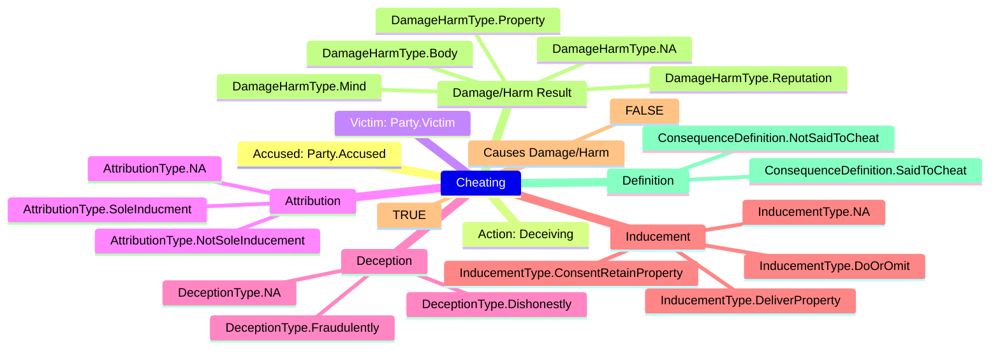
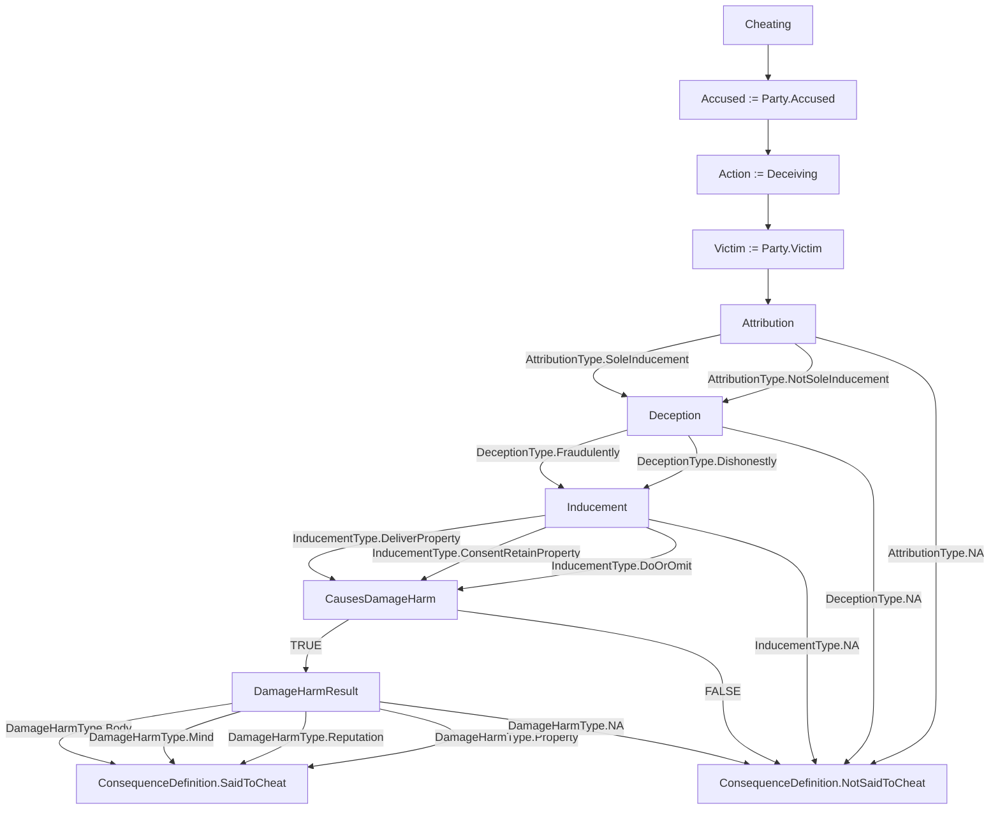

# Reworked example for S415 Cheating Statute

Here's the process of breaking down a statute's definition. The below example is done on the offense of Cheating under Penal Code S415.

In plaintext, Penal Code S415 is as below.

```txt
"Whoever, by deceiving any person, whether or not such deception was the sole or main inducement, fraudulently or dishonestly induces the person so deceived to deliver or cause the delivery of any property to any person, or to consent that any person shall retain any property, or intentionally induces the person so deceived to do or omit to do anything which he would not do or omit to do if he were not so deceived, and which act or omission causes or is likely to cause damage or harm to any person in body, mind, reputation or property, is said to cheat."
```

When including indentation to conceptually represent each idea introduced, the statute can be logically formatted as follows.

```txt
"Whoever, by deceiving any person, 
WHETHER OR NOT such deception was the sole or main inducement,
    fraudulently OR dishonestly induces the person so deceived
        to deliver any property to any person,
        OR to consent that any person shall retain any property,
    OR intentionally induces the person so deceived
        to do
        OR omit to do anything which he would not do
        OR omit if he were not so deceived
    AND which act or omission
        causes
        OR is likely to cause
            damage
            OR harm
        to that person in body, mind, reputation, or property,
is said to cheat."
```

Once converted to Yuho's syntax, the statute will be structured as follows.

> [!NOTE]
> For an annotated version of the below Yuho  
> code, see [s415_cheating_definition.yh](./../example/s415_cheating_definition.yh).  

```yh
/*
Based off the following statutory provisions on cheating
    * Penal Code S415
/* 

scope s415CheatingDefinition {

    // ~ ENUMS ~

    struct Party { 
        Accused,
        Victim,
    }

    struct AttributionType { 
        SoleInducment,
        NotSoleInducement,
        NA,
    }

    struct DeceptionType { 
        Fraudulently,
        Dishonestly,
        NA,
    }

    struct InducementType { 
        DeliverProperty,
        ConsentRetainProperty,
        DoOrOmit,
        NA,
    }

    struct DamageHarmType { 
        Body,
        Mind, 
        Reputation,
        Property,
        NA,
    }

    struct ConsequenceDefinition { 
        SaidToCheat,
        NotSaidToCheat,
    }

    // ~ STRUCT DEFINITION ~

    struct Cheating { 
        string || Party accused,
        string action,
        string || Party victim,
        AttributionType attribution,
        DeceptionType deception,
        InducementType inducement,
        boolean causesDamageHarm,
        {DamageHarmType} || DamageHarmType damageHarmResult, 
        ConsequenceDefinition definition,
    }

    // ~ STRUCT LITERAL ~

    Cheating cheatingDefinition := { 

        accused := Party.Accused,
        action := "deceiving",
        victim := Party.Victim,
        attribution := AttributionType.SoleInducment or AttributionType.NotSoleInducement or AttributionType.NA,
        deception := DeceptionType.Fraudulently or DeceptionType.Dishonestly or DeceptionType.NA,
        inducement := InducementType.DeliverProperty or InducementType.ConsentRetainProperty or InducementType.DoOrOmit or InducementType.NA, 
        causesDamageHarm := TRUE or FALSE,
        damageHarmResult := {
            DamageHarmType.Body,
            DamageHarmType.Mind,
            DamageHarmType.Reputation,
            DamageHarmType.Property,
        } or DamageHarmType.NA, 

        definition := match attribution {
            case AttributionType.SoleInducment := deception
            case AttributionType.NotSoleInducement := deception
            case AttributionType.NA := consequence ConsequenceDefinition.NotSaidToCheat
        },
        definition := match deception {
            case DeceptionType.Fraudulently := consequence inducement
            case DeceptionType.Dishonestly := consequence inducement
            case DeceptionType.NA := consequence ConsequenceDefinition.NotSaidToCheat
        },
        definition := match inducement {
            case InducementType.DeliverProperty := consequence causesDamageHarm
            case InducementType.ConsentRetainProperty := consequence causesDamageHarm
            case InducementType.DoOrOmit := consequence causesDamageHarm
            case InducementType.NA := consequence ConsequenceDefinition.NotSaidToCheat
        },
        definition := match causesDamageHarm {
            case TRUE := consequence damageHarmResult
            case FALSE := consequence ConsequenceDefinition.NotSaidToCheat
        },
        definition := match {
            case DamageHarmType.NA in damageHarmResult := consequence ConsequenceDefinition.NotSaidToCheat
            case _ :=  consequence ConsequenceDefinition.SaidToCheat 
        },

    }

}
```

This struct can then be transpiled to diagrammatic representations with tools like Mermaid.  

Right now two primary Mermaid outputs are supported.  

1. Mindmap
    * show all key elements of a statute at a glance
    * generated by parsing a struct instance


2. Flowchart
    * splay out all possible consequences of a statute
    * generated by parsing a struct instance


