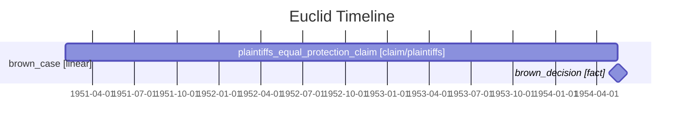

# Mermaid Export

Euclid can export a `.euclid` world as a Mermaid Gantt diagram for GitHub-native README and docs embeds.

```console
$ euclid export examples/legal/brown_plaintiffs.euclid -f mermaid -o brown.mmd
```

Paste the generated output into a Markdown fence:

````markdown

````

Mermaid's Gantt syntax supports `dateFormat`, `axisFormat`, sections, task rows, and milestones:
<https://mermaid.js.org/syntax/gantt.html>

## Mapping

| Euclid concept | Mermaid output |
| --- | --- |
| timeline | `section <timeline> [kind]` |
| entity appearance | Gantt task inside the matching timeline section |
| same-day appearance | `milestone` task |
| entity type | appended to task label as `[type]` |
| narrative field | appended to task label as `[type/narrative]` |
| all-date worlds | `dateFormat YYYY-MM-DD` and ISO dates |
| ordinal or mixed worlds | `dateFormat X` and Euclid ordinal values |

## Limits

Mermaid export is a distribution format, not Euclid's full renderer.

- Relationships are emitted only as a comment because Mermaid Gantt does not model relationship edges.
- `branch`, `parallel`, and `loop` timelines render as labeled sections. Their Euclid semantics are preserved in the section label but not visually encoded.
- Mixed date and integer timelines degrade to numeric ordinal output so the diagram remains parseable.
- Use SVG or HTML export when you need narrative colors, relationship lines, or contradiction highlighting.

For launch/demo visuals, prefer:

```console
$ euclid diff examples/legal/brown_plaintiffs.euclid examples/legal/brown_board.euclid -f svg -o brown-diff.svg
```

For GitHub-native embeds, prefer:

```console
$ euclid export examples/legal/brown_plaintiffs.euclid -f mermaid -o brown.mmd
```
