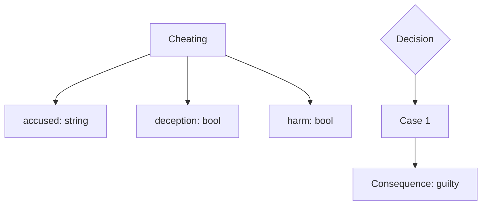
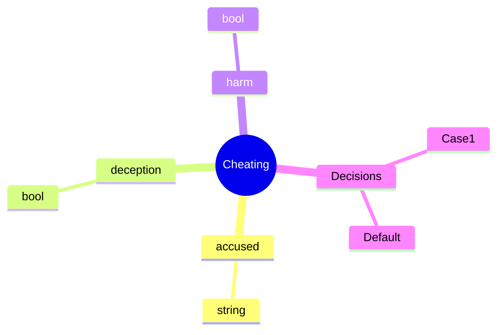
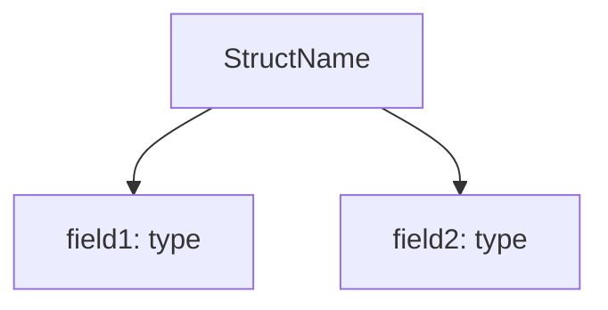
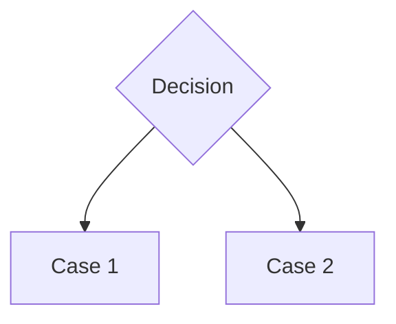
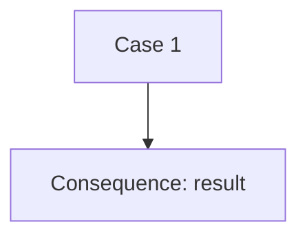
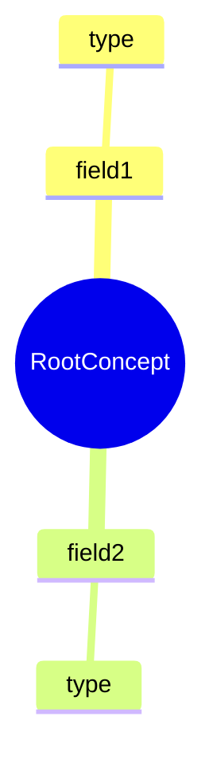
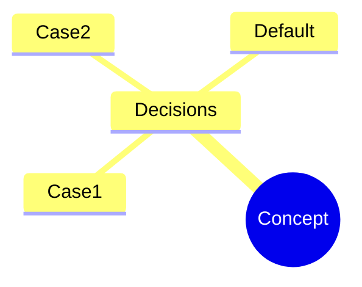
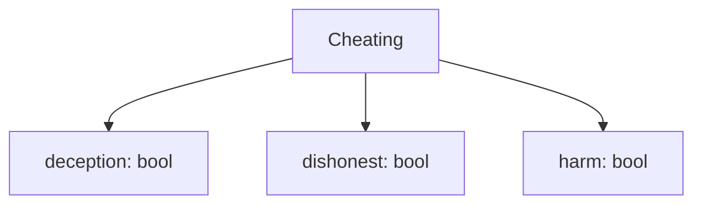

# Draw Command

The `yuho draw` command generates Mermaid diagrams from Yuho source files.

## Overview

The `draw` command creates visual representations of Yuho code:

- **Flowcharts** - Show control flow and conditional logic
- **Mindmaps** - Show hierarchical structure of legal concepts
- **Mermaid Output** - Compatible with Mermaid Live Editor and documentation

## Basic Usage

```bash
yuho draw <file_path> [OPTIONS]
```

### Examples

```bash
# Generate flowchart to stdout
yuho draw example.yh

# Generate flowchart to file
yuho draw example.yh --format flowchart -o diagram.mmd

# Generate mindmap
yuho draw example.yh --format mindmap -o mindmap.mmd
```

## Command Options

### `--output`, `-o`

Specify output file path:

```bash
yuho draw example.yh -o output.mmd
```

**Default**: Output to stdout

### `--format`, `-f`

Choose diagram format:

```bash
# Flowchart (default)
yuho draw example.yh --format flowchart

# Mindmap
yuho draw example.yh --format mindmap
```

**Options**:
- `flowchart` - Control flow and logic (default)
- `mindmap` - Hierarchical structure

## Output Formats

### Flowchart Format

Shows control flow and conditional logic:

```bash
yuho draw example.yh --format flowchart -o flowchart.mmd
```

**Example Output:**


### Mindmap Format

Shows hierarchical structure of legal concepts:

```bash
yuho draw example.yh --format mindmap -o mindmap.mmd
```

**Example Output:**


## Working with Examples

### Basic Cheating Example

**Yuho Code:**
```yh
// Section 415 - Cheating
struct Cheating {
    bool deception,
    bool dishonest,
    bool harm
}

match {
    case deception && dishonest && harm :=
        consequence "guilty of cheating";
    case _ :=
        consequence "not guilty of cheating";
}
```

**Generate Flowchart:**
```bash
yuho draw cheating.yh -f flowchart -o cheating_flow.mmd
```

**Generate Mindmap:**
```bash
yuho draw cheating.yh -f mindmap -o cheating_mind.mmd
```

### Complex Legal Example

**Yuho Code:**
```yh
// Section 378 - Theft
struct Theft {
    bool dishonestIntention,
    bool movableProperty,
    bool withoutConsent,
    bool movedProperty
}

match {
    case dishonestIntention && movableProperty && 
         withoutConsent && movedProperty :=
        consequence "guilty of theft";
    case _ :=
        consequence "not guilty of theft";
}
```

**Generate Diagrams:**
```bash
# Flowchart showing decision logic
yuho draw theft.yh -f flowchart -o theft_flow.mmd

# Mindmap showing elements
yuho draw theft.yh -f mindmap -o theft_mind.mmd
```

## Diagram Components

### Flowchart Components

#### Struct Nodes


#### Decision Nodes


#### Consequence Nodes


### Mindmap Components

#### Root Node


#### Decision Branches


## Use Cases

### Use Case 1: Legal Education

**Problem**: Students struggle to understand complex legal logic

**Solution**: Generate visual diagrams

```bash
# Create learning materials
yuho draw statute.yh -f flowchart -o learning_material.mmd
yuho draw statute.yh -f mindmap -o concept_map.mmd
```

**Result**: Clear visual representation of legal concepts

### Use Case 2: Legal Documentation

**Problem**: Need to document legal logic for stakeholders

**Solution**: Generate diagrams for documentation

```bash
# Generate documentation diagrams
yuho draw legal_concept.yh -f flowchart -o documentation.mmd
```

**Result**: Visual documentation that stakeholders can understand

### Use Case 3: Legal Analysis

**Problem**: Need to analyze legal logic for completeness

**Solution**: Generate diagrams to visualize logic flow

```bash
# Analyze legal logic
yuho draw analysis.yh -f flowchart -o analysis.mmd
```

**Result**: Visual analysis of legal logic completeness

## Integration with Documentation

### Markdown Integration

Embed diagrams in Markdown:

```markdown
# Legal Concept



### Mermaid Live Editor

1. Generate diagram:
```bash
yuho draw example.yh -f flowchart -o diagram.mmd
```

2. Copy content to [Mermaid Live Editor](https://mermaid.live/)

3. View and edit diagram

### GitHub Integration

GitHub automatically renders Mermaid diagrams:

```markdown
# Legal Logic


```

## Best Practices

### 1. Choose Appropriate Format

```bash
# Use flowchart for decision logic
yuho draw decision_logic.yh -f flowchart -o decision.mmd

# Use mindmap for concept hierarchy
yuho draw concept_hierarchy.yh -f mindmap -o concepts.mmd
```

### 2. Use Descriptive Filenames

```bash
# Good: Descriptive names
yuho draw cheating.yh -f flowchart -o cheating_decision_flow.mmd
yuho draw theft.yh -f mindmap -o theft_elements_mindmap.mmd

# Avoid: Generic names
yuho draw example.yh -f flowchart -o diagram.mmd
```

### 3. Generate Both Formats

```bash
# Generate both flowchart and mindmap
yuho draw legal_concept.yh -f flowchart -o legal_concept_flow.mmd
yuho draw legal_concept.yh -f mindmap -o legal_concept_mind.mmd
```

### 4. Integrate with Workflow

```bash
# Generate diagrams as part of build process
yuho draw examples/cheating/cheating_illustration_A.yh -f flowchart -o docs/cheating_flow.mmd
yuho draw examples/cheating/cheating_illustration_A.yh -f mindmap -o docs/cheating_mind.mmd
```

## Troubleshooting

### Common Issues

#### Issue 1: Invalid File

```bash
$ yuho draw invalid.yh
✗ Error: Invalid Yuho file
```

**Solution**: Check file with `yuho check` first:

```bash
yuho check invalid.yh
# Fix errors, then try again
yuho draw invalid.yh
```

#### Issue 2: Empty Output

```bash
$ yuho draw empty.yh
# No output generated
```

**Solution**: Ensure file has content:

```yh
// Add some content
struct Test {
    bool field
}

match {
    case field := consequence "result";
    case _ := consequence "default";
}
```

#### Issue 3: Permission Denied

```bash
$ yuho draw example.yh -o protected.mmd
✗ Error: Permission denied: protected.mmd
```

**Solution**: Check file permissions:

```bash
ls -la protected.mmd
chmod 644 protected.mmd
yuho draw example.yh -o protected.mmd
```

## Performance

### Generation Speed

Typical generation times:

| File Size | Statements | Flowchart Time | Mindmap Time |
|-----------|------------|----------------|--------------|
| Small | 1-10 | <10ms | <5ms |
| Medium | 11-100 | <50ms | <25ms |
| Large | 101-1000 | <500ms | <250ms |
| Very Large | 1000+ | <2s | <1s |

### Optimization Tips

1. **Use appropriate format** for your use case
2. **Generate to files** for repeated use
3. **Batch generate** multiple diagrams
4. **Cache results** for large files

## Advanced Usage

### Batch Processing

```bash
# Generate diagrams for all files
for file in examples/cheating/*.yh; do
    yuho draw "$file" -f flowchart -o "${file%.yh}_flow.mmd"
    yuho draw "$file" -f mindmap -o "${file%.yh}_mind.mmd"
done
```

### Custom Output

```bash
# Generate with custom naming
yuho draw example.yh -f flowchart -o "legal_concept_$(date +%Y%m%d).mmd"
```

### Integration with CI/CD

```bash
# Generate diagrams in CI pipeline
yuho draw examples/cheating/cheating_illustration_A.yh -f flowchart -o docs/cheating_flow.mmd
yuho draw examples/cheating/cheating_illustration_A.yh -f mindmap -o docs/cheating_mind.mmd
```

## Next Steps

- [Alloy Command](alloy.md) - Generate Alloy specifications
- [Draft Command](draft.md) - Create new Yuho files
- [REPL](repl.md) - Interactive development
- [Check Command](check.md) - Validate files before drawing
