# Architecture

## Module dependency graph

```mermaid
graph TD
    CLI[cli/main.py] --> Commands[cli/commands/*]
    CLI --> Services[services/analysis.py]
    Commands --> Services
    Commands --> Transpile[transpile/registry.py]
    Commands --> Verify[verify/combined.py]
    Commands --> Refs[library/reference_graph.py]
    Commands --> Recommend[recommend/charge_recommender.py]
    Commands --> Explore[explore/counterexamples.py]

    Services --> Parser[parser/wrapper.py]
    Services --> ASTBuilder[ast/builder.py]
    Services --> Lint[ast/statute_lint.py]
    Services --> Scope[ast/scope_analysis.py]
    Services --> TypeCheck[ast/type_check.py]

    Parser --> TreeSitter[src/tree-sitter-yuho/grammar.js]
    ASTBuilder --> Nodes[ast/nodes.py]
    ASTBuilder --> Visitor[ast/visitor.py]

    Scope --> Resolver[resolver/module_resolver.py]
    TypeCheck --> TypeInference[ast/type_inference.py]
    Lint --> Refs

    Transpile --> JSON[json_transpiler.py]
    Transpile --> English[english_transpiler.py]
    Transpile --> Latex[latex_transpiler.py]
    Transpile --> Mermaid[mermaid_transpiler.py]
    Transpile --> Mindmap[mermaid_mindmap_transpiler.py]
    Transpile --> Alloy[alloy_transpiler.py]
    Transpile --> DOCX[docx_transpiler.py]
    Transpile --> AKN[akomantoso_transpiler.py]

    Verify --> Z3[verify/z3_solver.py]
    Verify --> AlloyV[verify/alloy.py]

    LSP[lsp/server.py] --> Services
    LSP --> Refs
    MCP[mcp/server.py] --> Services
    MCP --> Refs
    Library[library/penal_code/*] --> Refs
```



## Directory structure

```
src/yuho/
├── ast/                 # AST nodes, builder, visitors, type/lint passes
├── cli/                 # Click CLI and command implementations
├── config/              # TOML configuration loading and masking
├── eval/                # Interpreter and defeasible evaluation helpers
├── explore/             # Counter-example exploration utilities
├── library/             # Package metadata, reference graph, graph lint
├── lsp/                 # Language Server Protocol implementation
├── mcp/                 # Model Context Protocol server
├── output/              # SARIF/JUnit output helpers
├── parser/              # Tree-sitter parser wrapper
├── recommend/           # Charge recommender over generated corpus
├── resolver/            # Module/import/reference resolution
├── services/            # Shared parse + AST + semantic analysis boundary
├── testing/             # Test infrastructure helpers
├── transpile/           # JSON, English, LaTeX, Mermaid, Alloy, DOCX, AKN
└── verify/              # Z3, Alloy, and combined verification runners
```

The tree-sitter grammar and generated parser live under
`src/tree-sitter-yuho/`; the packaged Python binding shim is
`src/tree_sitter_yuho/`.

## Data flow

```
.yh source
    |
    v
tree-sitter parse -> CST
    |
    v
ASTBuilder.build() -> ModuleNode
    |
    +-> lint/type/scope analysis
    +-> reference graph and semantic graph
    +-> transpilers (JSON, English, LaTeX, Mermaid, mindmap, Alloy, DOCX, AKN)
    +-> verifiers (Z3, Alloy)
    +-> editor and AI surfaces (LSP, MCP)
```

## Adding a new transpiler

1. Create `src/yuho/transpile/my_transpiler.py`.
2. Subclass `TranspilerBase` from `transpile/base.py`.
3. Implement `transpile(self, ast: ModuleNode) -> str | bytes`.
4. Add the target to `TranspileTarget` in `transpile/base.py`.
5. Register it in `transpile/registry.py`.
6. Add CLI handling in `src/yuho/cli/main.py` if the target needs custom
   output handling such as binary files.

See `json_transpiler.py` for the smallest text emitter and
`docx_transpiler.py` for a binary-output example.

## Adding a new CLI command

1. Create `src/yuho/cli/commands/my_command.py` with a `run_*` function.
2. Add the Click command in `src/yuho/cli/main.py` or the grouped command
   registry in `src/yuho/cli/commands_registry.py`.
3. Keep command modules import-light; expensive imports should happen
   inside the command body.

## Grammar changes

1. Edit `src/tree-sitter-yuho/grammar.js`.
2. Regenerate the parser with the tree-sitter CLI.
3. Update `src/yuho/ast/builder.py` and `src/yuho/ast/nodes.py` for any
   new syntax that survives into the AST.
4. Update transpilers, lint, LSP completion/highlighting, and MCP surfaces
   when the new syntax is user-visible.
5. Run targeted parser/AST tests and a corpus check over
   `library/penal_code`.
