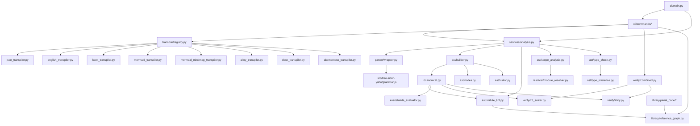

# Architecture

## Module Dependency Graph


```mermaid
graph TD
    CLI[cli/main.py] --> Commands[cli/commands/*]
    CLI --> Services[services/analysis.py]
    Commands --> Services
    Commands --> Transpile[transpile/registry.py]
    Commands --> Verify[verify/combined.py]
    Commands --> Refs[library/reference_graph.py]

    Services --> Parser[parser/wrapper.py]
    Services --> ASTBuilder[ast/builder.py]
    ASTBuilder --> CanonicalIR[ir/canonical.py]
    CanonicalIR --> Lint
    CanonicalIR --> Runtime[eval/statute_evaluator.py]
    Services --> Lint[ast/statute_lint.py]
    Services --> Scope[ast/scope_analysis.py]
    Services --> TypeCheck[ast/type_check.py]

    Parser --> TreeSitter[src/tree-sitter-yuho/grammar.js]
    ASTBuilder --> Nodes[ast/nodes.py]
    ASTBuilder --> Visitor[ast/visitor.py]

    Scope --> Resolver[resolver/module_resolver.py]
    TypeCheck --> TypeInference[ast/type_inference.py]
    Lint --> Refs

    CanonicalIR --> Z3
    CanonicalIR --> AlloyV

    Transpile --> JSON[json_transpiler.py]
    Transpile --> English[english_transpiler.py]
    Transpile --> Latex[latex_transpiler.py]
    Transpile --> Mermaid[mermaid_transpiler.py]
    Transpile --> Mindmap[mermaid_mindmap_transpiler.py]
    Transpile --> Alloy[alloy_transpiler.py]
    Transpile --> DOCX[docx_transpiler.py]
    Transpile --> AKN[akomantoso_transpiler.py]

    Verify --> Z3[verify/z3_solver.py]
    Verify --> AlloyV[verify/alloy.py]
    Library[library/penal_code/*] --> Refs
```

## Directory Structure

```text
src/yuho/
├── ast/                 # AST nodes, builder, visitors, type/lint passes
├── cli/                 # Click CLI and command implementations
├── eval/                # Interpreter and defeasible evaluation helpers
├── ir/                  # Versioned canonical semantic representation
├── library/             # Reference graph, semantic graph, graph lint
├── output/              # SARIF/JUnit output helpers
├── parser/              # tree-sitter parser wrapper
├── resolver/            # Module/import/reference resolution
├── services/            # Shared parse + AST + semantic analysis boundary
├── testing/             # Test infrastructure helpers
├── transpile/           # JSON, English, LaTeX, Mermaid, Alloy, DOCX, AKN
└── verify/              # Z3, Alloy, and combined verification runners
```

The tree-sitter grammar and generated parser live under
`src/tree-sitter-yuho/`; the packaged Python binding shim is
`src/tree_sitter_yuho/`.

## Semantic Boundary

The required semantic architecture is:

```text
grammar / CST
    -> versioned canonical IR
    -> semantic analysis
    -> runtime evaluation
    -> backend lowerings
    -> exports
```

No backend or exporter may treat a parser node as its semantic contract.
Each public construct needs an explicit capability record across parsing,
canonical IR, semantic analysis, runtime, every invoked backend, and each
export. A missing capability is an unsupported combination and must fail with
a diagnostic rather than silently approximate meaning.

The checked-in implementation lowers every parsed module to canonical-IR
schema `yuho.canonical-ir` version `1.0`. Its deterministic semantic digest is
distinct from its optional normalized source-text digest. Version 1 gives statutes,
scoped provisions, element groups, element burden metadata, and sibling
penalty blocks dedicated IR shapes; it retains a full immutable module
snapshot for constructs that have not migrated yet.

The AST remains an explicit transition adapter for expression execution, some
semantic checks, and most export/back-end lowerings. Those adapters are named
in the capability matrix in `src/yuho/ir/canonical.py`; unsupported
consumer/feature pairs must produce a `YIR…` diagnostic rather than silently
degrade. This is a compiler boundary, not an end-to-end refinement proof.

## Current Data Flow

```text
.yh source
    |
    v
tree-sitter parse -> CST
    |
    v
ASTBuilder.build() -> ModuleNode
    |
    v
lower_module() -> CanonicalIR v1.0 (deterministic semantic hash)
    |
    +-> canonical capability checks + AST-adapter semantic analysis
    +-> canonical runtime entry point + explicit AST expression adapter
    +-> Z3 / Alloy canonical adapter or unsupported diagnostic
    +-> AST-adapter exports until their IR migrations land
```

## Canonical-IR Migration Rule

New semantic behavior must define its canonical-IR representation and
versioning/migration rule before adding a lowering or export. A migration may
use a named AST adapter temporarily, but must test that adapter against the IR
and declare it as `ast_adapter`, not `modeled`. Persisted IR never retains a
Python AST reference. Until a construct has made that transition, backend and
export support must be described as partial or unsupported rather than implied
by parser acceptance.

## Adding a New Transpiler

1. Create `src/yuho/transpile/my_transpiler.py`.
2. Subclass `TranspilerBase` from `transpile/base.py`.
3. Implement `transpile(self, ast: ModuleNode) -> str | bytes`.
4. Add the target to `TranspileTarget` in `transpile/base.py`.
5. Register it in `transpile/registry.py`.
6. Add CLI handling in `src/yuho/cli/main.py` if the target needs custom
   output handling such as binary files.

See `json_transpiler.py` for the smallest text emitter and
`docx_transpiler.py` for a binary-output example.

## Adding a New CLI Command

1. Create `src/yuho/cli/commands/my_command.py` with a `run_*` function.
2. Add the Click command in `src/yuho/cli/main.py`.
3. Keep command modules import-light; expensive imports should happen
   inside the command body.

## Grammar Changes

1. Edit `src/tree-sitter-yuho/grammar.js`.
2. Regenerate the parser with the tree-sitter CLI.
3. Update `src/yuho/ast/builder.py` and `src/yuho/ast/nodes.py` for any
   new syntax that survives into the AST.
4. Update transpilers and lint checks when the new syntax is user-visible.
5. Run targeted parser/AST tests and a corpus check over
   `library/penal_code`.
