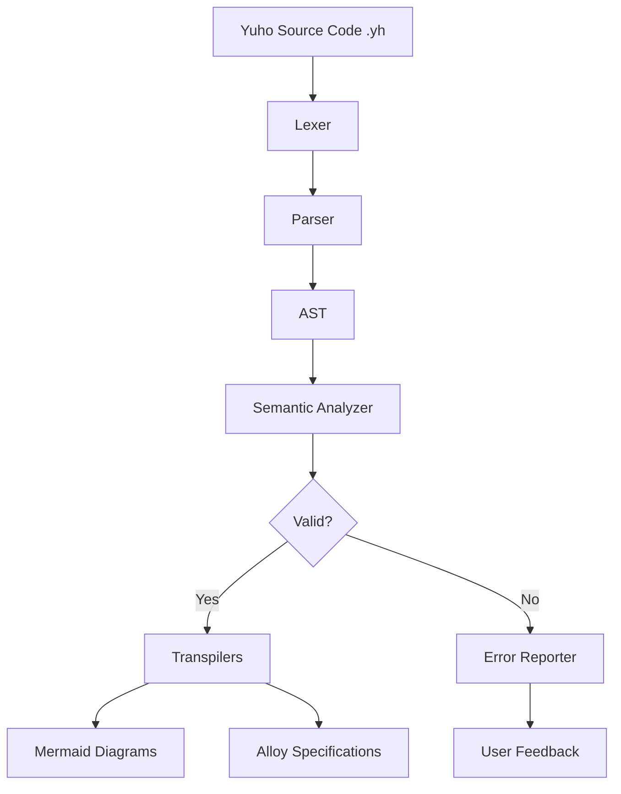
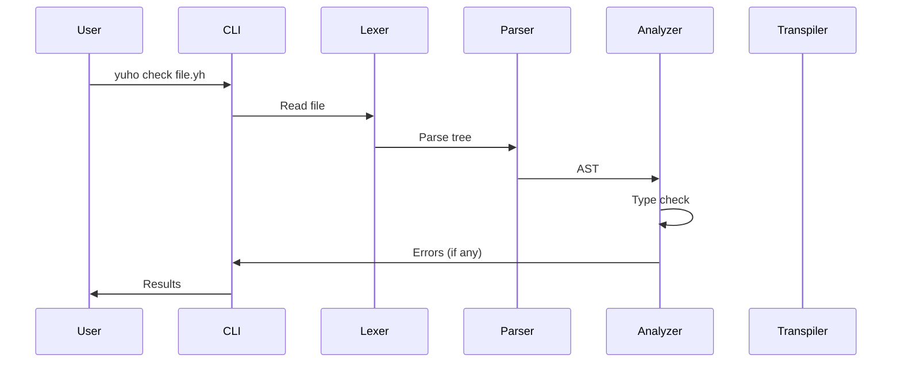
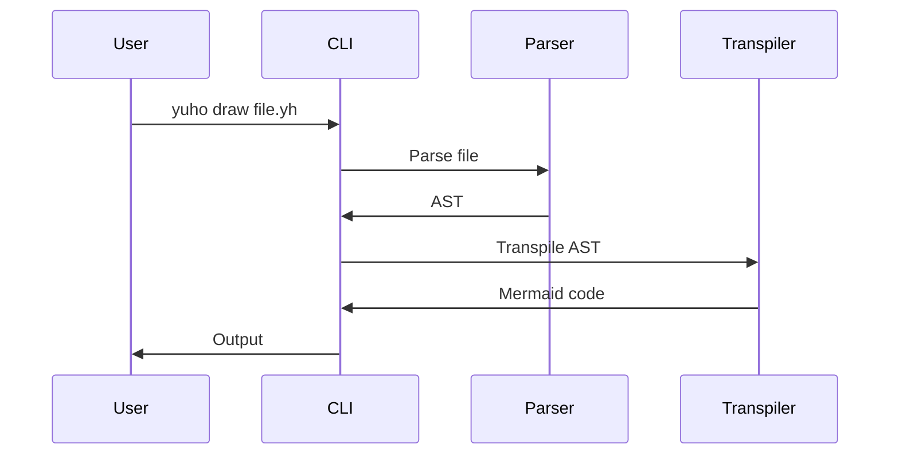

# Architecture

This document describes the architecture and design of Yuho v3.0.

## System Overview

Yuho is a domain-specific language (DSL) compiler/transpiler that processes legal statute representations and outputs various formats for visualization and verification.

## High-Level Architecture



## Component Architecture

### 1. Lexer (`lexer.py`)

**Purpose**: Tokenization and initial parsing using Lark parser

**Responsibilities**:
- Read Yuho source code
- Tokenize input using grammar rules
- Generate parse tree
- Report syntax errors

**Technology**: Lark (LALR parser generator)

```python
class YuhoLexer:
    def __init__(self):
        # Load grammar from grammar.lark
        
    def parse(self, text: str) -> Tree:
        # Parse text into Lark parse tree
```

### 2. Parser (`parser.py`)

**Purpose**: Transform parse trees into Abstract Syntax Trees (AST)

**Responsibilities**:
- Transform Lark parse trees into Yuho AST nodes
- Handle all language constructs
- Maintain source location information

**Key Classes**:
- `YuhoTransformer`: Lark transformer for AST generation
- `YuhoParser`: Main parser interface

```python
class YuhoParser:
    def parse(self, text: str) -> Program:
        # Parse text into Yuho AST
        
    def parse_file(self, filepath: str) -> Program:
        # Parse file into AST
```

### 3. AST Nodes (`ast_nodes.py`)

**Purpose**: Define all AST node types

**Node Hierarchy**:
```
ASTNode (base)
├── Program
├── Statement
│   ├── Declaration
│   ├── Assignment
│   ├── StructDefinition
│   ├── FunctionDefinition
│   ├── MatchCase
│   └── PassStatement
├── Expression
│   ├── Literal
│   ├── Identifier
│   ├── BinaryOperation
│   ├── UnaryOperation
│   └── FunctionCall
└── TypeNode
```

**Design Pattern**: Dataclasses for immutability and clarity

### 4. Semantic Analyzer (`semantic_analyzer.py`)

**Purpose**: Type checking, scope analysis, and semantic validation

**Responsibilities**:
- Type checking for all expressions
- Scope resolution and variable tracking
- Struct member validation
- Function signature verification
- Error collection and reporting

**Key Classes**:
- `SymbolTable`: Manages scopes and symbols
- `SemanticAnalyzer`: Main analysis engine

```python
class SemanticAnalyzer:
    def analyze(self, program: Program) -> List[str]:
        # Analyze AST and return errors
```

### 5. Transpilers

#### Mermaid Transpiler (`transpilers/mermaid_transpiler.py`)

**Purpose**: Generate Mermaid diagram specifications

**Output Formats**:
- Flowcharts: Representing control flow and logic
- Mindmaps: Representing hierarchical structure

**Algorithm**:
1. Traverse AST depth-first
2. Generate unique node IDs
3. Build Mermaid syntax for each node type
4. Connect nodes based on relationships

#### Alloy Transpiler (`transpilers/alloy_transpiler.py`)

**Purpose**: Generate Alloy specifications for formal verification

**Output Components**:
- Signatures: From struct definitions
- Predicates: From match-case logic
- Facts: From constraints
- Run commands: For verification

**Algorithm**:
1. Convert structs to Alloy signatures
2. Convert match-case to predicates
3. Map Yuho types to Alloy types
4. Generate verification commands

### 6. CLI (`cli/main.py`)

**Purpose**: Command-line interface for all Yuho operations

**Commands**:
- `check`: Validate Yuho files
- `draw`: Generate diagrams
- `alloy`: Generate Alloy specs
- `draft`: Create templates
- `how`: Show examples

**Technology**: Click framework for CLI

### 7. REPL (`repl.py`)

**Purpose**: Interactive shell for Yuho

**Features**:
- Live code evaluation
- Command history
- File loading
- Inline transpilation

## Data Flow

### Typical Compilation Pipeline



### Transpilation Pipeline



## Design Principles

### 1. Separation of Concerns
- Each component has a single, well-defined responsibility
- Clear interfaces between components
- Minimal coupling

### 2. Immutability
- AST nodes are immutable dataclasses
- Transformations create new structures
- Easier reasoning and testing

### 3. Type Safety
- Strong typing throughout
- Python type hints
- Runtime type checking in semantic analyzer

### 4. Error Handling
- Collect all errors, don't fail fast
- Provide helpful error messages
- Include source location information

### 5. Extensibility
- Easy to add new transpilers
- Plugin architecture possible
- Well-documented interfaces

## Testing Strategy

### Test Pyramid

```
          /\
         /  \    E2E Tests
        /----\
       /      \  Integration Tests  
      /--------\
     /          \ Unit Tests
    /------------\
```

**Unit Tests**: Individual component testing
- Lexer tokenization
- Parser AST generation
- Semantic analysis rules
- Transpiler output

**Integration Tests**: Component interaction
- Full parse → analyze pipeline
- Parse → transpile pipeline
- File I/O operations

**E2E Tests**: Complete workflows
- Real example files
- CLI commands
- Error scenarios

## Performance Considerations

### Current Optimizations
- LALR parsing (efficient)
- Single-pass semantic analysis
- Lazy evaluation where possible

### Future Optimizations
- Caching of parsed files
- Parallel analysis of independent files
- Incremental compilation

## Security Considerations

### Input Validation
- Grammar enforces syntax constraints
- Semantic analyzer validates types
- File path sanitization in CLI

### Resource Limits
- Parser timeout for large files
- Memory limits for AST size
- Stack depth limits for recursion

### Dependency Security
- Regular vulnerability scanning
- Minimal dependency surface
- Pinned versions in production

## Deployment Architecture

### Standalone CLI
```
┌─────────────────┐
│   User System   │
│                 │
│  ┌───────────┐  │
│  │   Yuho    │  │
│  │    CLI    │  │
│  └───────────┘  │
│                 │
│  .yh files      │
└─────────────────┘
```

### Docker Container
```
┌─────────────────────┐
│  Docker Container   │
│  ┌───────────────┐  │
│  │  Yuho Runtime │  │
│  └───────────────┘  │
│         │           │
│    ┌────▼────┐      │
│    │ Volumes │      │
│    └─────────┘      │
└─────────────────────┘
```

## Future Architecture Enhancements

### Language Server Protocol (LSP)
- Real-time syntax checking
- Auto-completion
- Go-to-definition

### Web Interface
- Browser-based editor
- Live preview
- Shared examples

### Plugin System
- Custom transpilers
- Custom validators
- Extension hooks

## References

- [Lark Parser Documentation](https://lark-parser.readthedocs.io/)
- [AST Design Patterns](https://en.wikipedia.org/wiki/Abstract_syntax_tree)
- [Compiler Design](https://en.wikipedia.org/wiki/Compiler)

