# Mermaid Transpiler

The Mermaid transpiler converts Yuho code into visual diagrams using Mermaid syntax.

## Overview

The Mermaid transpiler generates:

- **Flowcharts** - Show control flow and conditional logic
- **Mindmaps** - Show hierarchical structure of legal concepts
- **Visual Documentation** - Create diagrams for documentation
- **Interactive Diagrams** - Compatible with Mermaid Live Editor

## Supported Formats

### Flowchart Format

Shows decision logic and control flow:

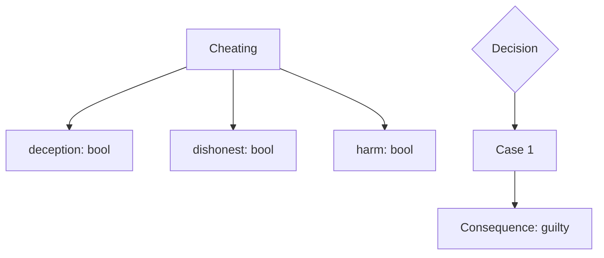

### Mindmap Format

Shows hierarchical structure:

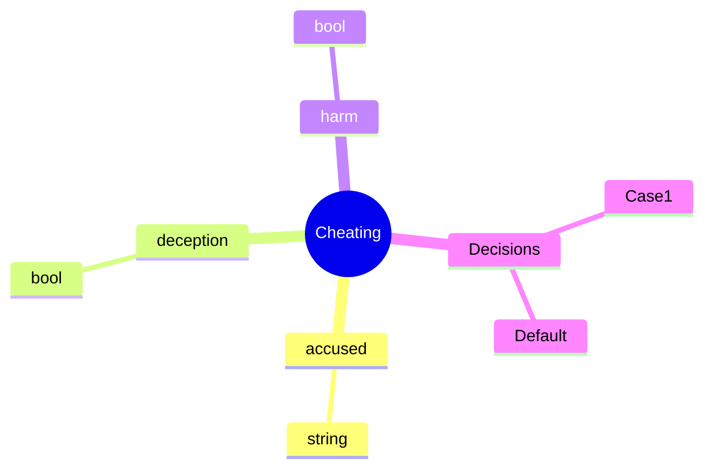

## Usage

### Basic Usage

```bash
# Generate flowchart
yuho draw example.yh --format flowchart -o diagram.mmd

# Generate mindmap
yuho draw example.yh --format mindmap -o mindmap.mmd
```

### CLI Integration

```bash
# Generate both formats
yuho draw legal_concept.yh -f flowchart -o legal_concept_flow.mmd
yuho draw legal_concept.yh -f mindmap -o legal_concept_mind.mmd
```

## Transpilation Process

### Step 1: Parse Yuho Code

```yh
// Section 415 - Cheating
struct Cheating {
    bool deception,
    bool dishonest,
    bool harm
}

match {
    case deception && dishonest && harm :=
        consequence "guilty of cheating";
    case _ :=
        consequence "not guilty of cheating";
}
```

### Step 2: Generate Flowchart

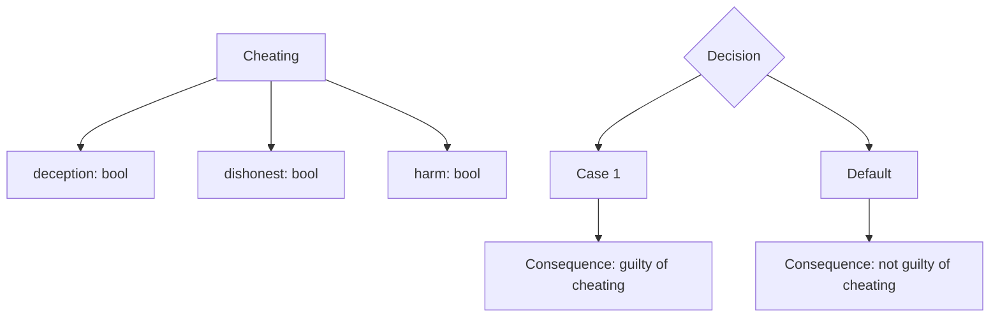

### Step 3: Generate Mindmap

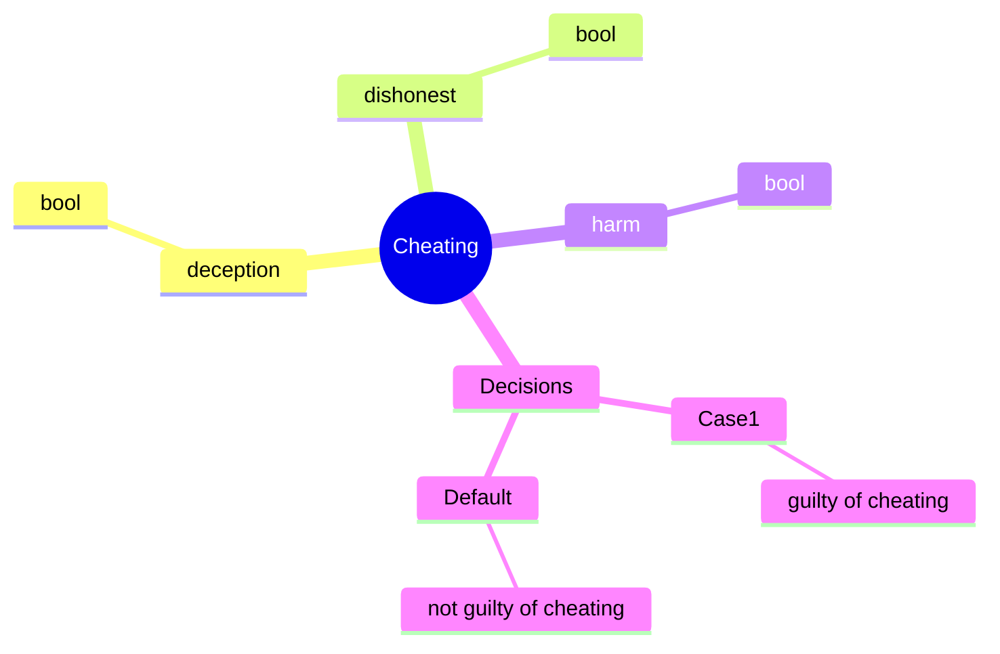

## Diagram Components

### Struct Nodes

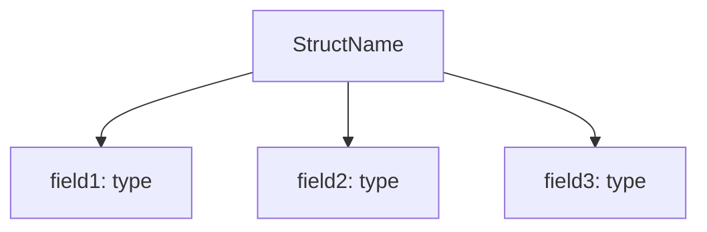

**Generated from:**
```yh
struct StructName {
    type field1,
    type field2,
    type field3
}
```

### Decision Nodes

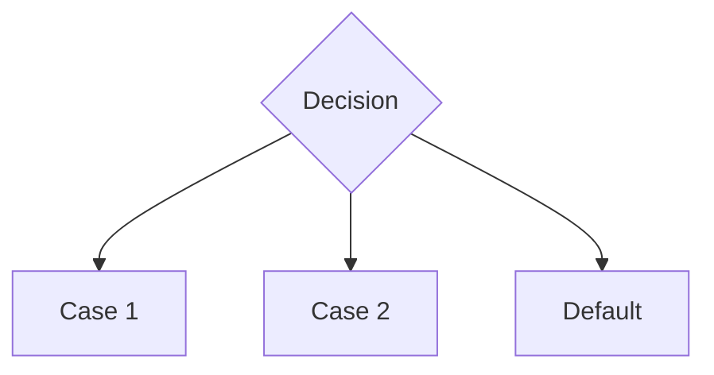

**Generated from:**
```yh
match {
    case condition1 := consequence result1;
    case condition2 := consequence result2;
    case _ := consequence default;
}
```

### Consequence Nodes

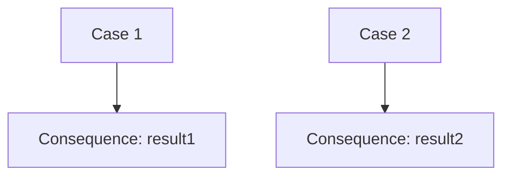

**Generated from:**
```yh
match {
    case condition1 := consequence result1;
    case condition2 := consequence result2;
    case _ := consequence default;
}
```

## Legal Examples

### Example 1: Cheating Offense

**Yuho Code:**
```yh
// Section 415 - Cheating
struct Cheating {
    string accused,
    bool deception,
    bool dishonest,
    bool harm
}

Cheating case1 := {
    accused := "Alice",
    deception := TRUE,
    dishonest := TRUE,
    harm := TRUE
};

match {
    case case1.deception && case1.dishonest && case1.harm :=
        consequence "guilty of cheating";
    case _ :=
        consequence "not guilty of cheating";
}
```

**Generated Flowchart:**
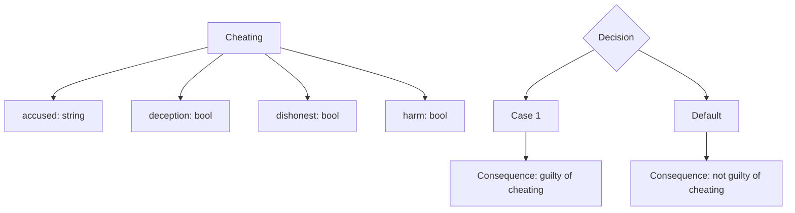

**Generated Mindmap:**
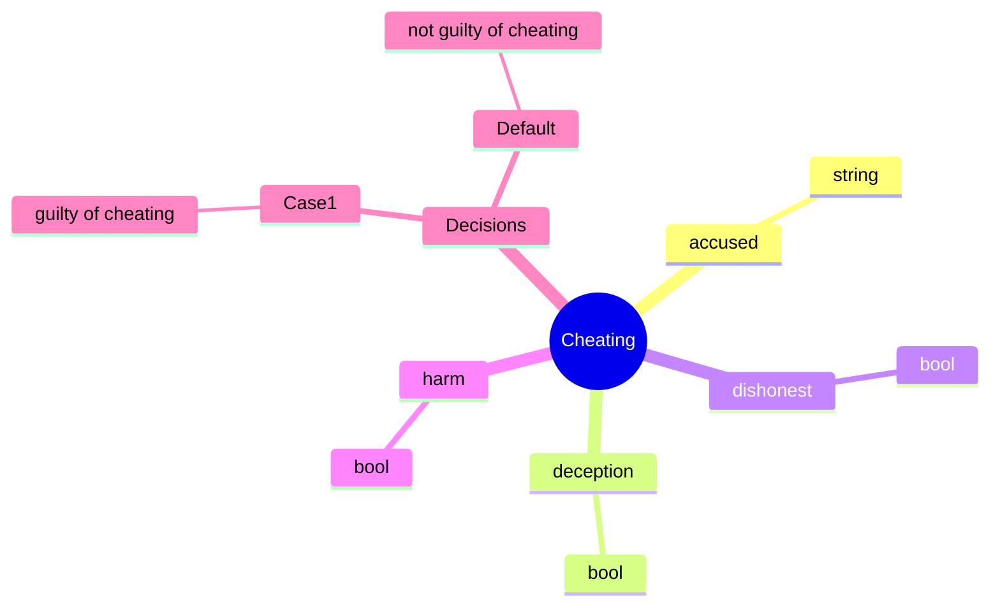

### Example 2: Theft Offense

**Yuho Code:**
```yh
// Section 378 - Theft
struct Theft {
    bool dishonestIntention,
    bool movableProperty,
    bool withoutConsent,
    bool movedProperty
}

match {
    case dishonestIntention && movableProperty && 
         withoutConsent && movedProperty :=
        consequence "guilty of theft";
    case _ :=
        consequence "not guilty of theft";
}
```

**Generated Flowchart:**
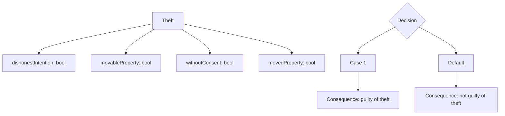

**Generated Mindmap:**
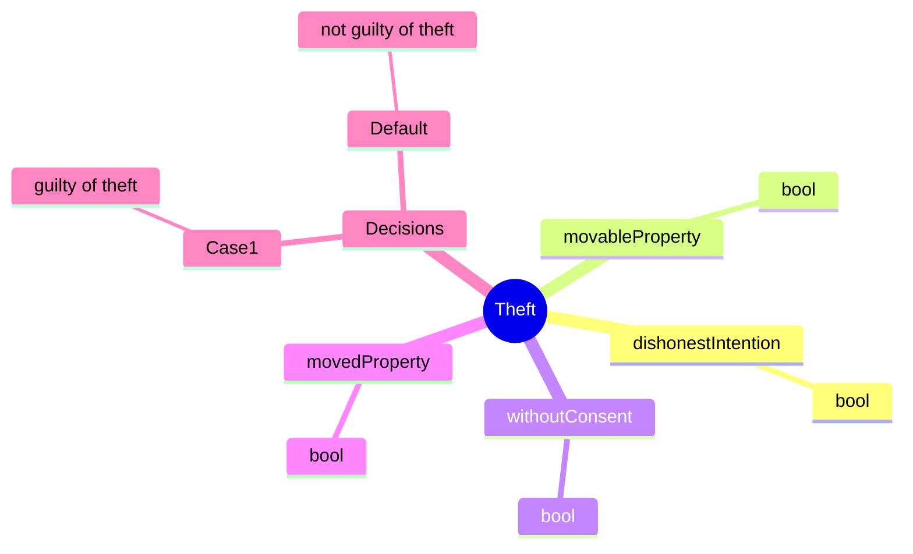

### Example 3: Complex Legal Logic

**Yuho Code:**
```yh
struct LegalCase {
    string caseNumber,
    bool isGuilty,
    money penalty
}

match {
    case isGuilty && penalty > $1000.00 :=
        consequence "severe punishment";
    case isGuilty && penalty <= $1000.00 :=
        consequence "moderate punishment";
    case _ :=
        consequence "not guilty";
}
```

**Generated Flowchart:**
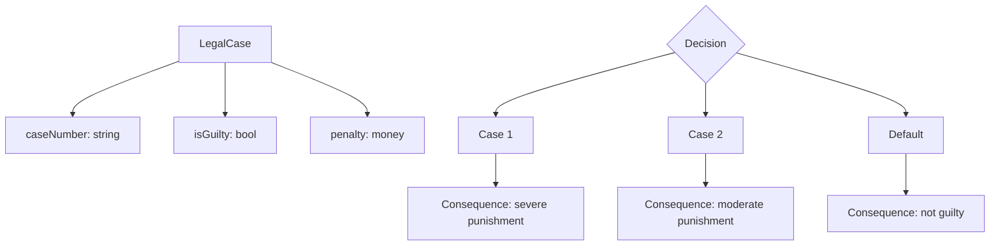

**Generated Mindmap:**
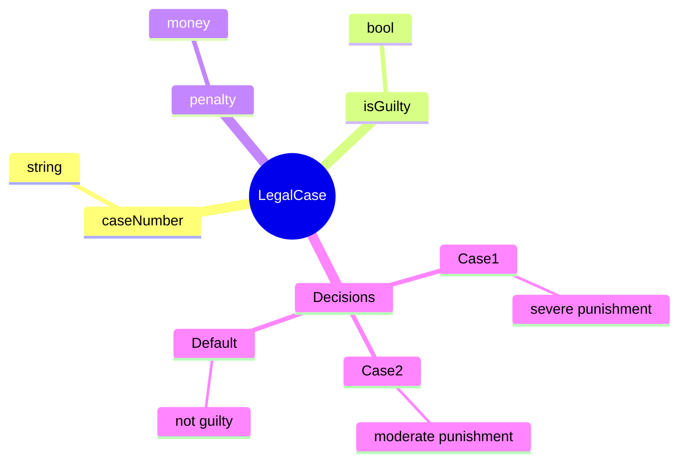

## Advanced Features

### Nested Structs

**Yuho Code:**
```yh
struct Address {
    string street,
    string city,
    string postalCode
}

struct Person {
    string name,
    int age,
    Address address
}
```

**Generated Flowchart:**
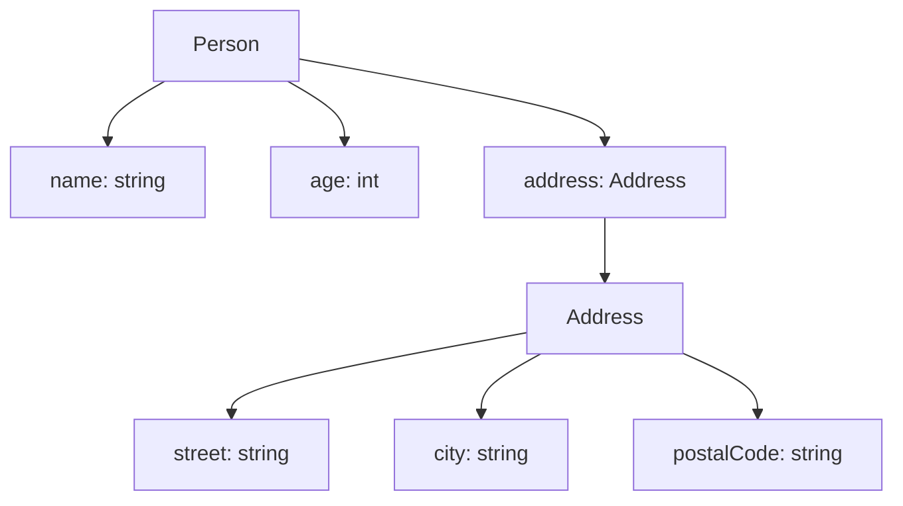

**Generated Mindmap:**
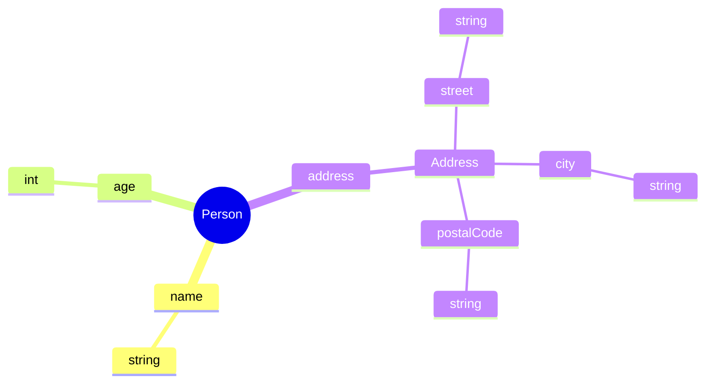

### Multiple Match-Case Statements

**Yuho Code:**
```yh
struct Offense {
    string name,
    bool isViolent,
    bool isRepeat
}

match {
    case isViolent && isRepeat :=
        consequence "life imprisonment";
    case isViolent :=
        consequence "10 years imprisonment";
    case _ :=
        consequence "2 years imprisonment";
}
```

**Generated Flowchart:**
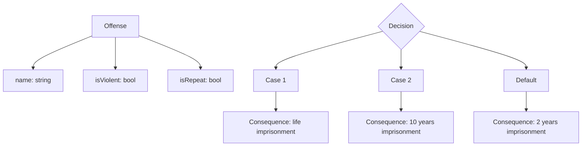

**Generated Mindmap:**
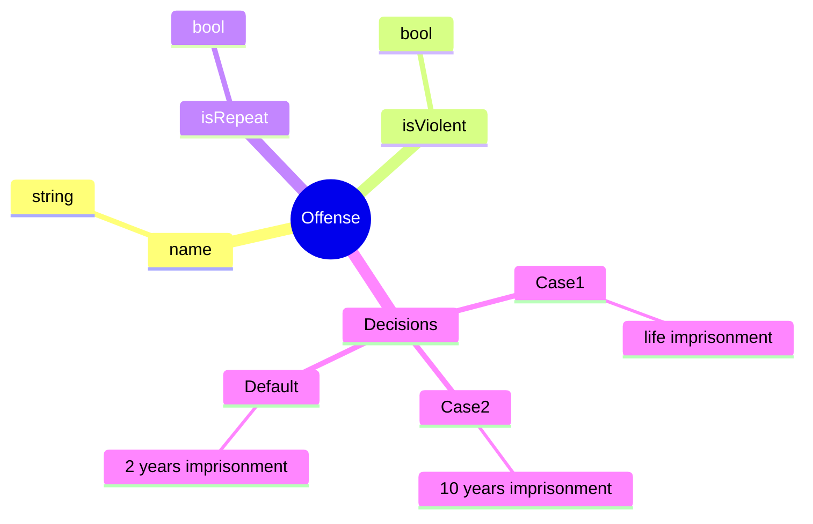

## Integration with Documentation

### Markdown Integration

Embed diagrams in Markdown:

```markdown
# Legal Concept

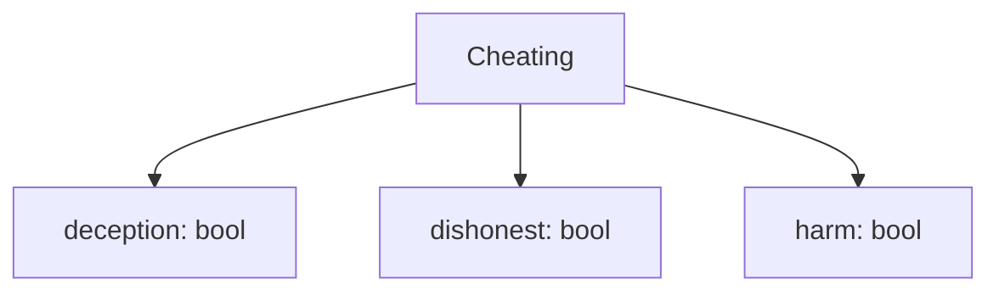
```

### GitHub Integration

GitHub automatically renders Mermaid diagrams:

```markdown
# Legal Logic


```

### Mermaid Live Editor

1. Generate diagram:
```bash
yuho draw example.yh -f flowchart -o diagram.mmd
```

2. Copy content to [Mermaid Live Editor](https://mermaid.live/)

3. View and edit diagram

## Best Practices

### 1. Choose Appropriate Format

```bash
# Use flowchart for decision logic
yuho draw decision_logic.yh -f flowchart -o decision.mmd

# Use mindmap for concept hierarchy
yuho draw concept_hierarchy.yh -f mindmap -o concepts.mmd
```

### 2. Use Descriptive Filenames

```bash
# Good: Descriptive names
yuho draw cheating.yh -f flowchart -o cheating_decision_flow.mmd
yuho draw theft.yh -f mindmap -o theft_elements_mindmap.mmd

# Avoid: Generic names
yuho draw example.yh -f flowchart -o diagram.mmd
```

### 3. Generate Both Formats

```bash
# Generate both flowchart and mindmap
yuho draw legal_concept.yh -f flowchart -o legal_concept_flow.mmd
yuho draw legal_concept.yh -f mindmap -o legal_concept_mind.mmd
```

### 4. Integrate with Workflow

```bash
# Generate diagrams as part of build process
yuho draw examples/cheating/cheating_illustration_A.yh -f flowchart -o docs/cheating_flow.mmd
yuho draw examples/cheating/cheating_illustration_A.yh -f mindmap -o docs/cheating_mind.mmd
```

## Troubleshooting

### Common Issues

#### Issue 1: Invalid Yuho File

```bash
$ yuho draw invalid.yh
✗ Error: Invalid Yuho file
```

**Solution**: Check file with `yuho check` first:

```bash
yuho check invalid.yh
# Fix errors, then try again
yuho draw invalid.yh
```

#### Issue 2: Empty Output

```bash
$ yuho draw empty.yh
# No output generated
```

**Solution**: Ensure file has content:

```yh
// Add some content
struct Test {
    bool field
}

match {
    case field := consequence "result";
    case _ := consequence "default";
}
```

#### Issue 3: Permission Denied

```bash
$ yuho draw example.yh -o protected.mmd
✗ Error: Permission denied: protected.mmd
```

**Solution**: Check file permissions:

```bash
ls -la protected.mmd
chmod 644 protected.mmd
yuho draw example.yh -o protected.mmd
```

## Performance

### Generation Speed

Typical generation times:

| File Size | Statements | Flowchart Time | Mindmap Time |
|-----------|------------|----------------|--------------|
| Small | 1-10 | <10ms | <5ms |
| Medium | 11-100 | <50ms | <25ms |
| Large | 101-1000 | <500ms | <250ms |
| Very Large | 1000+ | <2s | <1s |

### Optimization Tips

1. **Use appropriate format** for your use case
2. **Generate to files** for repeated use
3. **Batch generate** multiple diagrams
4. **Cache results** for large files

## Advanced Usage

### Batch Processing

```bash
# Generate diagrams for all files
for file in examples/cheating/*.yh; do
    yuho draw "$file" -f flowchart -o "${file%.yh}_flow.mmd"
    yuho draw "$file" -f mindmap -o "${file%.yh}_mind.mmd"
done
```

### Custom Output

```bash
# Generate with custom naming
yuho draw example.yh -f flowchart -o "legal_concept_$(date +%Y%m%d).mmd"
```

### Integration with CI/CD

```bash
# Generate diagrams in CI pipeline
yuho draw examples/cheating/cheating_illustration_A.yh -f flowchart -o docs/cheating_flow.mmd
yuho draw examples/cheating/cheating_illustration_A.yh -f mindmap -o docs/cheating_mind.mmd
```

## Next Steps

- [Alloy Transpiler](alloy.md) - Generate Alloy specifications
- [CLI Commands](../cli/commands.md) - Command-line interface
- [Examples](../examples/criminal-law.md) - Legal examples
- [Language Guide](../language/overview.md) - Yuho language reference
