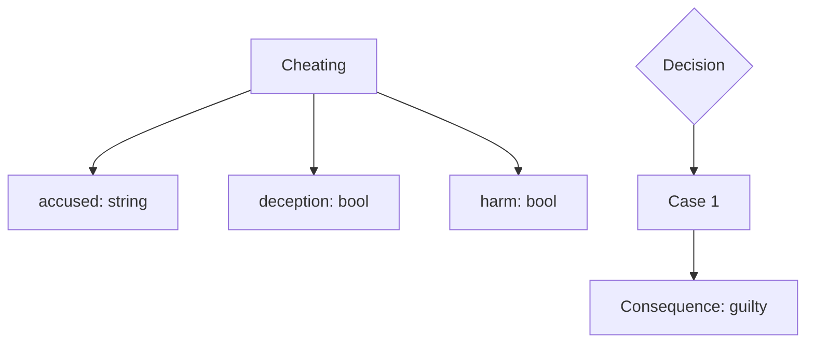
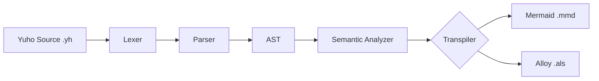

# Transpilers Overview

Yuho transpiles legal code to multiple target formats for visualization and formal verification.

## What is a Transpiler?

A **transpiler** (source-to-source compiler) converts Yuho source code into other formats while preserving the logical meaning.

Yuho's transpilers enable:
- **Visualization**: Understand complex legal logic through diagrams
- **Verification**: Formally prove correctness using automated tools
- **Documentation**: Generate visual documentation automatically

## Available Transpilers

### 1. Mermaid Transpiler

**Target**: [Mermaid](https://mermaid.js.org/) diagram syntax

**Purpose**: Generate visual diagrams that can be rendered in browsers, Markdown files, and documentation.

**Output Formats**:
- **Flowcharts**: Show control flow and conditional logic
- **Mindmaps**: Show hierarchical structure of legal concepts

**Usage**:
```bash
# Flowchart
yuho draw example.yh --format flowchart -o diagram.mmd

# Mindmap
yuho draw example.yh --format mindmap -o mindmap.mmd
```

**Example Output** (Flowchart):


**Learn More**: [Mermaid Transpiler Details](mermaid.md)

---

### 2. Alloy Transpiler

**Target**: [Alloy](https://alloytools.org/) specification language

**Purpose**: Generate formal specifications for automated logical verification and model checking.

**Output Components**:
- **Signatures**: From Yuho structs
- **Predicates**: From match-case logic
- **Facts**: From constraints and relationships
- **Run Commands**: For automated verification

**Usage**:
```bash
yuho alloy example.yh -o specification.als
```

**Example Output**:
```alloy
// Generated Alloy specification from Yuho
module YuhoGenerated

abstract sig Bool {}
one sig True, False extends Bool {}

sig Cheating {
  accused: String,
  deception: Bool,
  harm: Bool
}

pred MatchCase0[x: univ] {
  // Match expression conditions
  (deception = True and harm = True) => {
    // Consequence: guilty
  }
}

run {} for 5
```

**Learn More**: [Alloy Transpiler Details](alloy.md)

---

## Transpilation Pipeline



### Step-by-Step Process

1. **Lexing**: Tokenize Yuho source code
2. **Parsing**: Build Abstract Syntax Tree (AST)
3. **Semantic Analysis**: Validate types and semantics
4. **Transpilation**: Convert AST to target format
5. **Output**: Write to file or stdout

## Use Cases

### Use Case 1: Visual Documentation

**Problem**: Legal statutes are hard to understand

**Solution**: Generate flowcharts showing logic flow

```bash
# Create visual documentation
yuho draw statute.yh -f flowchart -o statute_diagram.mmd

# View in browser with Mermaid Live Editor
# Or embed in Markdown documentation
```

**Result**: Clear visual representation of conditional logic

---

### Use Case 2: Formal Verification

**Problem**: Need to prove logical consistency of legal rules

**Solution**: Generate Alloy specification and verify

```bash
# Generate Alloy specification
yuho alloy statute.yh -o statute.als

# Verify with Alloy Analyzer
java -jar alloy.jar statute.als
```

**Result**: Automated verification of logical correctness

---

### Use Case 3: Teaching Legal Logic

**Problem**: Students struggle with statute structure

**Solution**: Generate mindmaps showing hierarchy

```bash
# Create learning materials
yuho draw statute.yh -f mindmap -o learning_material.mmd
```

**Result**: Visual learning aids for legal education

---

## Transpiler Architecture

### Common Components

All transpilers share:

1. **AST Traversal**: Walk through the Abstract Syntax Tree
2. **Type Mapping**: Convert Yuho types to target types
3. **Logic Translation**: Convert match-case to target constructs
4. **Code Generation**: Output in target format

### Mermaid Transpiler

**Location**: `yuho_v3/transpilers/mermaid_transpiler.py`

**Key Features**:
- Node ID generation for unique identifiers
- Recursive AST traversal
- Format-specific output (flowchart vs mindmap)

**Algorithm**:
```python
def transpile_to_flowchart(program):
    1. Initialize output with "flowchart TD"
    2. For each statement:
        - Generate unique node ID
        - Convert to Mermaid syntax
        - Add to output
    3. Connect nodes based on relationships
    4. Return Mermaid code
```

### Alloy Transpiler

**Location**: `yuho_v3/transpilers/alloy_transpiler.py`

**Key Features**:
- Struct to signature conversion
- Match-case to predicate conversion
- Type system mapping
- Verification command generation

**Algorithm**:
```python
def transpile(program):
    1. Process structs → Generate signatures
    2. Process match-case → Generate predicates
    3. Add boolean signatures (True/False)
    4. Add run commands
    5. Return Alloy specification
```

---

## Type Mapping

### Yuho to Mermaid

Mermaid is primarily visual, so types appear as labels:

| Yuho Type | Mermaid Representation |
|-----------|------------------------|
| `int` | `field: int` |
| `string` | `field: string` |
| `bool` | `field: bool` |
| Custom struct | `field: CustomType` |

### Yuho to Alloy

| Yuho Type | Alloy Type |
|-----------|------------|
| `int` | `Int` |
| `float` | `Int` (Alloy has no floats) |
| `bool` | `Bool` (custom signature) |
| `string` | `String` |
| `percent` | `Int` |
| `money` | `Int` |
| `date` | `String` |
| `duration` | `String` |
| Custom struct | Custom signature |

---

## Adding New Transpilers

Want to add a new transpiler? Here's how:

### 1. Create Transpiler Module

```python
# yuho_v3/transpilers/my_transpiler.py

class MyTranspiler:
    def __init__(self):
        self.output = []
    
    def transpile(self, program: Program) -> str:
        """Transpile Yuho AST to target format"""
        for stmt in program.statements:
            self._process_statement(stmt)
        return self._generate_output()
    
    def _process_statement(self, stmt):
        # Handle different statement types
        if isinstance(stmt, StructDefinition):
            self._handle_struct(stmt)
        elif isinstance(stmt, MatchCase):
            self._handle_match(stmt)
    
    def _generate_output(self) -> str:
        # Generate final output
        return "\n".join(self.output)
```

### 2. Add CLI Command

```python
# yuho_v3/cli/main.py

@cli.command()
@click.argument('file_path', type=click.Path(exists=True))
@click.option('--output', '-o', help='Output file path')
def mytarget(file_path, output):
    """Generate my target format from Yuho file"""
    parser = YuhoParser()
    ast = parser.parse_file(file_path)
    
    transpiler = MyTranspiler()
    result = transpiler.transpile(ast)
    
    if output:
        with open(output, 'w') as f:
            f.write(result)
    else:
        click.echo(result)
```

### 3. Add Tests

```python
# yuho_v3/tests/test_my_transpiler.py

def test_my_transpiler():
    parser = YuhoParser()
    transpiler = MyTranspiler()
    
    code = "struct Test { string field }"
    ast = parser.parse(code)
    result = transpiler.transpile(ast)
    
    assert result is not None
    assert "Test" in result
```

---

## Future Transpilers

Potential targets for future transpilers:

### Legal Formats
- **LegalRuleML**: XML-based legal rule representation
- **LKIF**: Legal Knowledge Interchange Format
- **Akoma Ntoso**: Legal document XML standard

### Programming Languages
- **Python**: Executable Python code
- **Prolog**: Logic programming
- **JSON/YAML**: Data interchange formats

### Visualization
- **GraphViz**: Advanced graph visualization
- **PlantUML**: UML diagrams
- **D3.js**: Interactive visualizations

### Verification Tools
- **Coq**: Proof assistant
- **Z3**: SMT solver
- **TLA+**: Formal specification

---

## Performance Considerations

### Optimization Tips

1. **Large Files**: Transpilation is O(n) where n = AST nodes
2. **Caching**: Parser results can be cached for repeated transpilations
3. **Streaming**: For very large files, consider streaming output
4. **Parallel**: Multiple files can be transpiled in parallel

### Benchmarks

Typical transpilation times (on modern hardware):

| File Size | Statements | Time |
|-----------|------------|------|
| Small | 1-10 | <10ms |
| Medium | 11-100 | <50ms |
| Large | 101-1000 | <500ms |
| Very Large | 1000+ | <2s |

---

## Troubleshooting

### Transpilation Errors

**Issue**: Transpilation fails with error

**Solutions**:
1. Check that file passes `yuho check`
2. Ensure all types are defined
3. Verify match-case coverage

### Output Issues

**Issue**: Generated output is incorrect

**Solutions**:
1. Check Yuho syntax is correct
2. Verify semantic analysis passes
3. Report bug with minimal example

### Target Tool Issues

**Issue**: Generated file won't open in target tool

**Solutions**:
- **Mermaid**: Test in Mermaid Live Editor
- **Alloy**: Verify with Alloy Analyzer
- Check target tool version compatibility

---

## Resources

- [Mermaid Documentation](https://mermaid.js.org/)
- [Alloy Documentation](https://alloytools.org/)
- [Yuho Architecture](../development/architecture.md)
- [AST Nodes Reference](../api/ast.md)

---

## See Also

- [Mermaid Transpiler Details](mermaid.md)
- [Alloy Transpiler Details](alloy.md)
- [CLI Commands](../cli/commands.md)
- [Examples](../examples/criminal-law.md)

