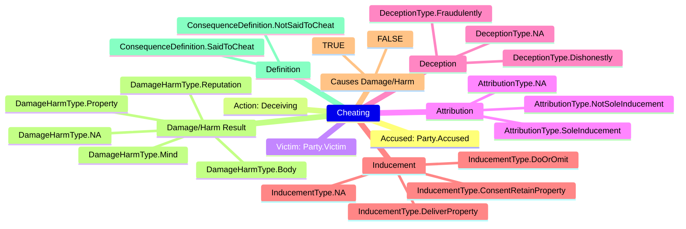
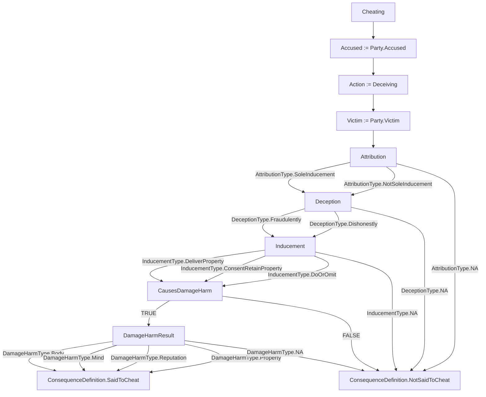

# Learn how Yuho works in 5 minutes

## What will you learn?

By the end of this guide, you will be able to:

1. **Break down** a statute into its constituent elements (actus reus, mens rea, circumstance)
2. **Model** those elements and their logical relationships in a `.yh` file
3. **Generate** plain English explanations and visual diagrams from your model
4. **Test** hypothetical fact patterns against your statute model

> No programming experience is required. If you can read a statute and spot its elements, you can use Yuho.

## Introduction


[Legalese is hard to understand](https://www.reddit.com/r/LawSchool/comments/l099fe/why_are_legal_documents_hard_to_understand_for_a/) for those unfamiliar with it.

In fact, many even argue [legal jargon is a language unto itself](https://law.stackexchange.com/questions/95218/is-legalese-a-thing-in-languages-other-than-english).

[Yuho](https://github.com/gongahkia/yuho) makes reading legalese easier to understand by reformatting and standardising the [informal logic of the law](https://plato.stanford.edu/entries/logic-informal/) into the [formal logic of mathematics and computer science](https://plato.stanford.edu/entries/logic-classical/).

Yuho is founded on the following beliefs.

1. Legalese is hard to understand
2. Textual explanations are good
3. Diagrammatic explanations are excellent

## Why not just use markdown notes?

Law students already break statutes into elements in handwritten or typed notes. Yuho adds three concrete advantages over free-form notes:

1. **Machine validation** -- Yuho checks your model is structurally complete. Forgot to specify mens rea? The linter catches it.
2. **Automatic diagramming** -- Your notes become visual flowcharts and mindmaps with a single command. No manual drawing.
3. **Reusability** -- Import definitions across statutes. The definition of "dishonestly" (s24) is used by both s378 Theft and s415 Cheating. Define it once, reference it everywhere.

## An example

Statutes aren't always intuitive.

Below is Section 415 of the [Penal Code 1871](https://sso.agc.gov.sg/Act/PC1871) on the offense of Cheating in plaintext.

```txt
"Whoever, by deceiving any person, whether or not such deception was the sole or main inducement, fraudulently or dishonestly induces the person so deceived to deliver or cause the delivery of any property to any person, or to consent that any person shall retain any property, or intentionally induces the person so deceived to do or omit to do anything which he would not do or omit to do if he were not so deceived, and which act or omission causes or is likely to cause damage or harm to any person in body, mind, reputation or property, is said to cheat."
```

Say we attempt to break the statute into its composite elements and include indentation to represent the logical relationship between those elements. You could end up with something like this.

```txt
"Whoever, by deceiving any person,
WHETHER OR NOT such deception was the sole or main inducement,
    fraudulently OR dishonestly induces the person so deceived
        to deliver any property to any person,
        OR to consent that any person shall retain any property,
    OR intentionally induces the person so deceived
        to do
        OR omit to do anything which he would not do
        OR omit if he were not so deceived
    AND which act or omission
        causes
        OR is likely to cause
            damage
            OR harm
        to that person in body, mind, reputation, or property,
is said to cheat."
```

Still, the conditional relationship each element shares with the overall offense is not explicit.

This is where Yuho comes in.

Once someone has learnt the basics of Yuho's terse syntax, they will be able to model that same statute in Yuho as below. First, we define the types that capture each element of the offense:

```yh
// enum-like structs for each element category

struct AttributionType {
    SoleInducement,
    NotSoleInducement,
    NA,
}

struct DeceptionType {
    Fraudulently,
    Dishonestly,
    NA,
}

struct InducementType {
    DeliverProperty,
    ConsentRetainProperty,
    DoOrOmit,
    NA,
}

struct DamageHarmType {
    Body,
    Mind,
    Reputation,
    Property,
    NA,
}

// the case struct captures all relevant facts
struct CheatingCase {
    string accused,
    string victim,
    string action,
    string deceptionType,
    string inducementType,
    bool causesDamageHarm,
    string damageHarmType,
}
```

Then, we model the statute itself using Yuho's `statute` block with definitions, elements, penalty, and illustrations:

```yh
fn evaluateCheating(string deceptionType, string inducementType, bool causesDamageHarm) : string {
    match {
        case TRUE if deceptionType == "none" := consequence "Not cheating - no deception";
        case TRUE if inducementType == "none" := consequence "Not cheating - no inducement";
        case TRUE if causesDamageHarm := consequence "Said to cheat";
        case _ := consequence "Not said to cheat";
    }
}

statute 415 "Cheating" {
    definitions {
        deceive := "To cause a person to believe something that is false";
        fraudulently := "With intent to defraud another person";
        dishonestly := "With intention of causing wrongful gain or wrongful loss";
    }

    elements {
        actus_reus deception := "Deceiving any person";
        mens_rea intent := "Fraudulently or dishonestly";
        actus_reus inducement := "Inducing delivery of property, consent to retain, or act/omission";
        circumstance harm := "Causing or likely to cause damage to body, mind, reputation, or property";
    }

    penalty {
        imprisonment := 1 year .. 7 years;
        fine := $0.00 .. $50,000.00;
    }

    illustration example1 {
        "A intentionally deceives B into believing that a worthless article is valuable, and thus induces B to buy it. A cheats."
    }

    illustration example2 {
        "A falsely pretends to be in government service and induces B to let him have goods on credit. A cheats."
    }
}
```

This Yuho code can then be transpiled using the Yuho CLI (`yuho transpile`) to various representations including [Mermaid](https://mermaid.js.org/) diagrams.

Right now two primary Mermaid outputs are supported.

1. Mindmap
    * displays key elements of a statute at a glance
    * generated by parsing a struct instance


2. Flowchart
    * splays out a statute's event logic
    * generated by parsing a struct instance



Yuho's `elements` block also supports separating *Material facts*, *Mens Rea* and *Actus Reus* using element type annotations. When transpiled to Mermaid, these produce subgraph-grouped flowcharts and mindmaps. See the `library/` directory for full examples.

## English output

Running `yuho transpile my_statute.yh -t english` on the s415 example above produces:

```
SECTION 415: Cheating
============================================================

Definitions:
  "deceive" means To cause a person to believe something that is false
  "fraudulently" means With intent to defraud another person
  "dishonestly" means With intention of causing wrongful gain or wrongful loss

Elements of the offence:
  Physical element (actus reus): Deceiving any person
  Mental element (mens rea): Fraudulently or dishonestly
  Physical element (actus reus): Inducing delivery of property, consent to retain, or act/omission
  Surrounding circumstance: Causing or likely to cause damage to body, mind, reputation, or property

Penalty:
  Imprisonment: 1 year to 7 years
  Fine: up to $50,000.00

Illustrations:
  [example1] A intentionally deceives B into believing that a worthless article
  is valuable, and thus induces B to buy it. A cheats.

  [example2] A falsely pretends to be in government service and induces B to let
  him have goods on credit. A cheats.
```

This output lets you verify your model captures all the elements you intended.

## Viewing Mermaid diagrams

After running `yuho transpile my_statute.yh -t mermaid`, you can view the output in three ways:

1. **Browser** -- paste the output into [mermaid.live](https://mermaid.live) for instant rendering
2. **GitHub** -- wrap the output in a ` ```mermaid ` code block in any `.md` file. GitHub renders it natively
3. **Local notes or docs** -- paste the output into any Mermaid-capable editor, notes app, or documentation page

## Using the wizard (no code required)

`yuho wizard` walks you through creating a statute model interactively:

```
$ yuho wizard

Welcome to the Yuho Statute Wizard!
This will guide you through creating a .yh statute file.

Section number: 378
Statute title: Theft

Add definitions (enter blank line when done):
  Term: movableProperty
  Definition: Any corporeal property except land and things attached to the earth
  Term: dishonestly
  Definition: With intention of causing wrongful gain or wrongful loss
  Term:

Add elements (enter blank line when done):
  Type (actus_reus/mens_rea/circumstance): actus_reus
  Name: taking
  Description: Taking any moveable property out of the possession of any person
  Type: mens_rea
  Name: intent
  Description: Intending to take dishonestly
  Type: actus_reus
  Name: moving
  Description: Moving that property without that person's consent
  Type:

Add penalty:
  Imprisonment range (e.g. 1 year .. 3 years): 1 year .. 7 years
  Fine range (e.g. $0.00 .. $10,000.00): $0.00 .. $10,000.00

Output file [s378_theft.yh]: s378_theft.yh
Statute written to s378_theft.yh
```

The wizard generates valid `.yh` code you can then transpile, test, or edit further.

## Using the REPL

`yuho repl` provides an interactive environment for experimenting:

```
$ yuho repl
Yuho REPL - Interactive statute experimentation
Type help for commands, exit to quit

yuho> struct Verdict { guilty, notGuilty, mistrial }
Parsed: 1 struct(s)

yuho> fn assess(bool evidence) : string {
  ...     match {
  ...         case TRUE if evidence := consequence "Guilty";
  ...         case _ := consequence "Not guilty";
  ...     }
  ... }
Parsed: 1 function(s)

yuho> load library/penal_code/s415_cheating/statute.yh
Loaded: 1 struct(s), 3 function(s), 1 statute(s)

yuho> transpile english
=== ENGLISH Output ===
SECTION 415: Cheating
...

yuho> transpile mermaid
=== MERMAID Output ===
mindmap
    Cheating
    ...
```

Available REPL commands: `load <file>`, `transpile <target>`, `ast`, `history`, `reset`, `help`, `exit`.

## Testing fact patterns

You can model a hypothetical and evaluate it against a statute definition:

```yh
import "penal_code/s415_cheating"

// model a fact pattern as a struct literal
CheatingCase hypo := CheatingCase {
    accused := "D",
    victim := "V",
    action := "falsely claiming goods are organic produce",
    deceptionType := "dishonestly",
    inducementType := "DeliverProperty",
    causesDamageHarm := TRUE,
    damageHarmType := "Property",
}

// evaluate the fact pattern against the statute
assert evaluate_cheating("dishonestly", "DeliverProperty", TRUE) == "Said to cheat";
```

Run with `yuho test my_hypo.yh`. Each `assert` either passes silently or reports which element was not satisfied.

## Modelling guidance

How granular should your model be? It depends on the use case.

| Approach | When to use | Example |
|:---------|:------------|:--------|
| **Coarse** | Quick reference cards, exam revision | One `actus_reus` and one `mens_rea` per offense |
| **Granular** | Detailed analysis, flowchart generation | Separate elements for each disjunctive/conjunctive branch |

For s300 Murder which has 4 alternative mens rea limbs, a coarse model might collapse them:

```yh
elements {
    actus_reus act := "Causing death of a person";
    mens_rea intent := "Intention or knowledge as defined in s300(a)-(d)";
}
```

A granular model would separate each limb:

```yh
elements {
    actus_reus act := "Causing death of a person";
    mens_rea intentionToCauseDeath := "Intention of causing death";
    mens_rea intentionToHurt := "Intention of causing bodily injury known to be likely to cause death";
    mens_rea sufficientInOrdinay := "Intention of causing bodily injury sufficient in the ordinary course of nature to cause death";
    mens_rea dangerousAct := "Knowledge that the act is so imminently dangerous that it must in all probability cause death";
}
```

## Yuho and IRAC

Law students structure legal reasoning using IRAC (Issue, Rule, Application, Conclusion). Yuho maps to the **Rule** component:

| IRAC step | Yuho mapping |
|:----------|:-------------|
| **Issue** | Identifying which statute applies (outside Yuho) |
| **Rule** | The `statute` block: `definitions`, `elements`, `penalty` |
| **Application** | The `illustration` block and `fn evaluate_*` functions |
| **Conclusion** | The `consequence` result of a `match-case` expression |

Yuho does not replace IRAC. It sharpens the **R** by forcing you to explicitly identify every element and its classification (actus reus, mens rea, circumstance).

## Formal verification (advanced)

Yuho can transpile to [Alloy](https://alloytools.org/) for formal consistency checking. This lets you verify properties like:

> "No fact pattern can simultaneously satisfy s299 Culpable Homicide without also satisfying one of s300 Murder's exceptions."

```bash
yuho transpile library/penal_code/s300_murder/statute.yh -t alloy > murder.als
# open murder.als in Alloy Analyzer to run checks
```

This is entirely optional and targeted at advanced users interested in formal methods.

## Where to go next?

* Learn Yuho's syntax at [`SYNTAX.md`](../researcher/syntax.md)
* See statute examples in the [`library/`](../../library/) directory
* Try the interactive wizard: `yuho wizard`
* Experiment in the REPL: `yuho repl`
* Install and try Yuho: `pip install yuho` then run `yuho --help`
* Explore the CLI commands: `yuho check`, `yuho transpile`, `yuho explain`
* Want to contribute? See [`CONTRIBUTING.md`](../../.github/CONTRIBUTING.md)
