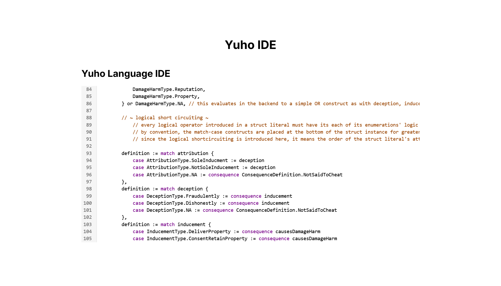

# Yuho Browser IDE

Syntax highlighting implemented based on [Yuho 2.0](./../../../src/)'s syntax.

Made with React, Next.js and Tailwind CSS.



## Usage

For local deployment, run the following.

```console
$ cd src/yuho-browser-ide
$ npm install @uiw/react-codemirror @codemirror/language @codemirror/state @codemirror/view @lezer/highlight
$ npm run dev
```

Then visit [`http://localhost:3000`](http://localhost:3000).