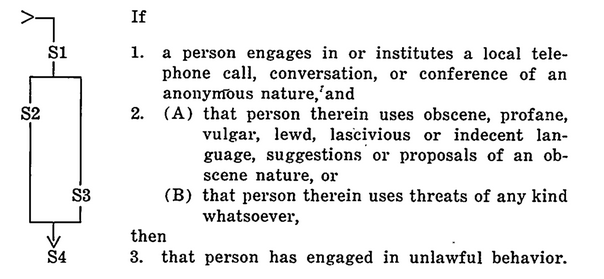
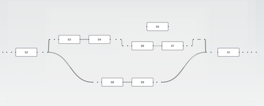
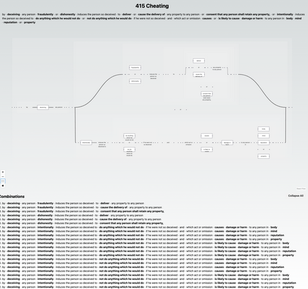

# Yuho v4.0 Kanban Board

| 🔙 | ✍️ | 🗳️ | 👏 |
| :---: | :---: | :---: | :---: |
| [**Backlog**](#backlog) (9) | [**Doing**](#doing) (1) | [**Review**](#review) | [**Done**](#done) |

## Backlog

### 2. Logic engine

1. Implement the Espresso-IISOJS npm libarry for heuristic minimiation of single-output boolean functions myself in python or whatever language I choose to write this in, probably just use Python for simplicity
1. Can represent everything as truth values first
2. Can evaluate those truth values
3. Handles
    1. Boolean minimization
        1. As applied in *Poh Yuan Nie v Public Prosecutor [2022] SGCA 74* in Meng's presentation to me on 13/09/24
        2. A more complex statement should evaluate to a less complex one
            1. eg. `"Driving while intoxicated" IS NOT NOT NOT NOT NOT AN OFFENCE` = `"Driving while intoxicated" IS AN OFFENCE`
            2. eg. `"Entering the premises without permission" IF AND ONLY IF "breaking a window"` = `"Breaking a window" -> "Entering the premises without permission"`
            3. eg. `"Carrying a concealed weapon" AND "Committing theft" IS AN OFFENCE` = `"Committing theft" IS AN OFFENCE` and `"Carrying a concealed weapon" IS AN OFFENCE` 
            4. eg. `"Selling prohibited substances" IS AN OFFENCE AND IS NOT AN OFFENCE` == CONTRADICTION and will be flagged
            5. eg. `NOT "Assaulting a police officer" IF AND ONLY IF "Acting in self-defense"` = `"Acting in self-defense" -> NOT "Assaulting a police officer"`
    2. Contradiction flagging
    3. Variable substitution
        1. `(A and B) or (C and D and E)`, assuming we define `E in terms of C` which looks like `E = ! C` = `(A and B) or (C and D and not C)`
        2. now imagine E is "property" and C is defined as what is NOT property OR property's actual definition
        3. also this has a contradiction inside!
        4. simplification of boolean circuits is super relevant because it means we don't even need to waste resources validating D
        5. this means we have dropped from 5 cardinals to 2 cardinals
        6. also implement recursive definitions that will render the evaluation of statutes easier 
            1. eg. cheating s415 has the word dishonestly, wrongful gain and wrongful loss, defined in s23 and 24 respectively
    4. eliminating logic redundancy
    5. ignoring don't care terms and can't happen terms
4. Allows for expressing statutes in terms of formal logic
    1. Per *Normalized legal drafting and the query method*
    2. Elimination of contradiction
    3. Simplification of complex legalese
    4. Simplification of nonsensical obiter and ratio
5. Can dynamically generate a truth table from specified truth values and their relationships in any propositional formula presented
    1. TRUTH VALUES are replaced by statutes and its subdivisions
6. Flags logical contradictions and fallacies
7. Validates whether a given statement is logically coherent or not
8. look into SAT solving and other formal methods to identify logical fallacies and issues with logic
9. logic engine should be able to 
    1. evaluate basic propositional formulas
    2. handle basic inconsitency checking 
    3. accelerate testing facilities for DSLs

### 3. Code examples

1. Add all examples of sample Yuho code in the ./example file directory, 
2. Represent the Spandeck test in Yuho for tort duty of care *(type of harm, threshold requirement and 2 stages of proximity and public policy considerations)*
3. Represent old UK tests in Yuho for tort duty of care
4. Add focus on whether the relationship shared between kinds of harm caused 
5. Could the transpiler generate a degree_of_liability represented as a float?
6. Interlinks between statutes
    1. Complex provisions have terms like “subject to” that logically connect different sections or entire statutes *(by way of providing explanation or exception for a given rule or term)*
    2. Provide an example of how Yuho can represent 2 statutes interacting
    3. Or remove this entire follow up action Or move it to FUTURE.md

### 4. Tokenisor, Parser, Interpreter

1. Add the logic for the tokenisor, parser and interpreter in ./src file directory

### 5. Tests

1. Add proper tests that are runnable within Alloy or find another framework to run tests in

### 6. Transpiler

1. Brainstorm transpilation outputs for Yuho
2. Diagrammatic outputs
    1. Mermaid diagrams, primarily with flowcharts
    2. [Ladder diagrams](https://github.com/smucclaw/ladder-diagram) 
    3. ASCII diagrams
    4. PLANTUML diagrams
    5. graphviz
    6. [kroki](https://kroki.io/) 
    7. d2
    8. [tonto](https://github.com/matheuslenke/Tonto)
    9. [enso](https://github.com/enso-org/enso)
3. Textual outputs
    1. ...
4. Programatic outputs
    1. ...
5. purpose of this would be to 
    1. convert ambigious within-sentence syntax into an unambigious between-sentence syntax
    2. disambiguiting the relevant aspects of within-sentence syntax

### 7. Web frontend

1. a frontend web display 
2. see Wong Meng Weng's [react application]() that shows the multiple pathways that are possible 
3. INCLUDE a similar field below *(generated dynamically by traversing all paths one can take)* that shows ALL POSSIBLE paths that the reading of a given statute can take as seen below
4. Diagrammatic representation should show ALL possible permutations of a given offence 
    1. These permutations can then be checked against a specified situation to determine applicability
5. Diagrammatic representation could also include the given Yuho code for a specified situation
6. DSL diagrammatic representations should be able to account for base assumptions that are implicit within the law
    1. which court can hear a given case?
    2. which jurisdiction a case can be heard in?
    3. what constitutes a person per the specific act?
    4. eg. in s415, the act would not apply for those who are not singaporeans, can we edit the diagrammatic representation to account for that?
        1. end goal of making what is implicit explicit
        2. perhaps could consider making these implicit assumptions explicit by specifying them as preconditions within the list of all permutations
7. Still lacking diagrammatic representation that can reflect that a given statute is contingent on another statute, brainstorm how to reflect that in the web frontend
8. [Google Blocky](https://github.com/google/blockly) API 
    1. Svelteflow API for a drag and drop interface to interact with Yuho DSL

### 8. README.md

1. Edit README.md to more accurately reflect Yuho's purpose
2. Include an ASCII architecture diagram 
3. Include a mermaid architecture diagram
4. Benefits of a DSL is that code makes all things explicit while the law features many assumptions that are implicit
5. Yuho as a DSL benefits from the law as code mindset by rendering these assumptions in detail
6. Yuho's usecases
    1. purpose would be for law students to identify defective logic, charges and rulings when applying statutes
    2. purpose would be for lawyers, lawmakers and drafters to avoid wasting precious court time rationalilising or applying obiter and judgements that make little sense
7. Research
    1. research cannons of interpretation and construction in law and those that are relevant for the implementation of DSLs and heuristic minimalisation 
    2. eg.
        1. harmonious construction
        2. rule against surplusage
        3. etc...

### 9. "CLI tools"

1. Create a suite of Yuho CLI tools
2. Brainstorm further tools and their names similar to AGAMOTO and ASSERT 
    1. Basically ALL CLI TOOLS are not CLI tools but are instead run in-line from within Yuho files under a given scope
    2. The only CLI tool I want for Yuho is the interpreter and transpiler which also runs from within a given Yuho scope and file
    3. Naming convention would be along the line of "clerk" for Elegant Elephant
3. Make them easy to install, learn and use
4. References for decent CLI tools
    1. Rust Cargo
    2. Python Pip
    3. FZF
    4. Git

### 10. Web Wikipage

1. For learning Yuho's syntax easily
2. Can integrate the Yuho web frontend under point [7.](#7-web-frontend)
3. Similar to [catala-lang.org](https://catala-lang.org/en)

## Doing

### 1. Syntax

1. Consider including a syntax that can represent probabilistic events like COULD, WOULD and research more what kinds of probability there are, use GPT for brainstorming syntax 
1. Edit SYNTAX.md and add the below
    * Consider possible syntax to represent the applied rule identifiers in a more natural language kind of way
        * Look into how Catala and L4 handle concepts like this
        * Then work from there
        * Otherwise adopt the syntax from V2.0 but just clean it up further
    * REFERENCING <scope identifier> FROM <file name omitting the .yh portion similar to Go>
        * anything within the current scope will be brought into the present file
    * `#` *(for comments)*
    * SCOPE 
        * RUN: a special scope that is the equivalent of the main function in most other programming languages
        * Everything placed within the SCOPE RUN of any file will be automatically run when the given file is executed
        * Yuho files lacking a SCOPE RUN call will be treated as module files
    * `:` *(to define scope alongside 4-tab indentation similar to Python)*
    * STRUCT
        * the singular flexible datatype anyway to define further nuanced relationships
        * STRUCTs can represent multiple datatypes in other languages like and are represented as such in the back-end
            * STRUCT.ARRAY
            * STRUCT.TUPLE
            * STRUCT.DICTIONARY
            * STRUCT.STRUCT
            * STRUCT.ENUM
    * NA *(equivalent to None and evaluates to Null back-end)*
    * NOT
    * `()` *(to group logical statements together)*
    * AND
    * OR *(equivalent of XOR)*
    * AND OR *(equivalent of IOR)*
    * RULE
    * LOGIC
    * MATCH CASE -> CONSEQUENCE
    * _ 
    * EXCEPTION
        * Used to specify exceptions to an existing statute that has already been defined, allows for easier grouping
        * Exceptions are sym-linked as an array of exceptions that are checked back-end when a propositional formula is evaluted and handled through AGAMOTTO and ASSERT
    * AGAMOTTO
        * Command called in-line
        * For enumerating upon and displaying all possible permutations of a RESULT of a given statute or process representation in Yuho
        * AGAMOTTO_RESULT
            * Returns a string array of all possible RESULT CONSEQUENCEs of a given statute representation in Yuho
        * AGAMOTTO (default)
            * Returns a string array of all possible Yuho-enumerated outcomes and their RESULT CONSEQUENCES of a given statute representation
            * Shows the logical flow and propositional statements that led the outcome's evaluation
    * APPLY, ASSERT
        * Command called in-line similar to AGAMOTTO
        * Called with the syntax ASSERT CONSEQUENCE *<specific CONSEQUENCE value, doesn't have to be an endpoint just any value in the chain of reasoning>* WHERE APPLY *<existing rule identfier>* IN *<existing rule instance identifier>*
        * Applied rule instance identifiers are user-defined scenarios that they apply a given rule to
            * Helps test validity of a CONSEQUENCE outcome when specifying a chain of predicates within that rule to determine whether a given outcome can arise when following the logic of a rule if certain predicates are fulfilled
            * Introduces the syntax WHERE and IN
        * Evaluates either to WRONGFUL or RIGHTFUL with the corresponding rationale explained as below
    * WRONGFUL, RIGHTFUL as validation state / error messages 
        * eg. WRONGFUL -> FALSE_APPLICATION_OF_RULE
        * eg. WRONGFUL -> CONTRADICTION 
        * eg. WRONGFUL -> CAUSATION_ERROR 
        * eg. RIGHTFUL -> TRUE_APPLICATION_OF_RULE
        * eg. RIGHTFUL -> VALID_ARGUMENT 
2. Datatypes
    1. Primitives
        1. STRING
        2. NUMBER
            1. Back-end covers
                1. NUMBER.INTEGER
                2. NUMBER.FLOAT
        3. BOOLEAN
            1. BOOLEAN.TRUE
            2. BOOLEAN.FALSE
    2. Complex
        1. MONEY
            1. Back-end represented as NUMBER.FLOAT
        2. DATE
            1. Back-end represented as STRING
        3. TIME
            1. Back-end represented as NUMBER.FLOAT
        4. RESULT 
            1. Specific datatype for what is specified after the CONSEQUENCE keyword
            1. Back-end represented as STRING 
        5. STATE
            1. STATE.WRONGFUL
            2. STATE.RIGHTFUL
            3. Stored as conceptually distinct from BOOLEAN
3. Try writing out MORE of the statutes with this syntax in .yh in the examples directory 
4. Try writing out MORE of the cases with the defined syntax in .yh in the examples directory
5. When syntax is formalised add it to SYNTAX.md
    1. Extract further cases from my tort notes google slides, ideally get 1 case from each week
    2. Extract further concepts from my tort notes google slides, ideally get 1 concept from each week
    3. See Jerrold Soh's tort slides for the cases of 
        1. See Toh Siew Kee v Ho Ah Lam Ferrocement Pte Ltd and others 2012
        2. NTUC Foodfare Co-operative Ltd v SIA Engineering Co Ltd and another 2018
        3. Singapore Rifle Association v Singapore Shooting Association 2018
    3. And can the diagrammatic representation make sense
6. Syntax must be 
    1. simple to learn, read and write
    2. easy to tokenise, parse and interpret
    3. general enough to represent any statutory law
    4. be able to represent common law rulings and statutes
    5. able to define a given term or idea recursively
    6. all keywords should aim to be familar to lawyers and the layperson and not too technical to avoid a steep learning curve
    7. account for subsidiary legislation as well and distinguish it from primary legislation

## Review

### 1. 

## Done

### 1. 
