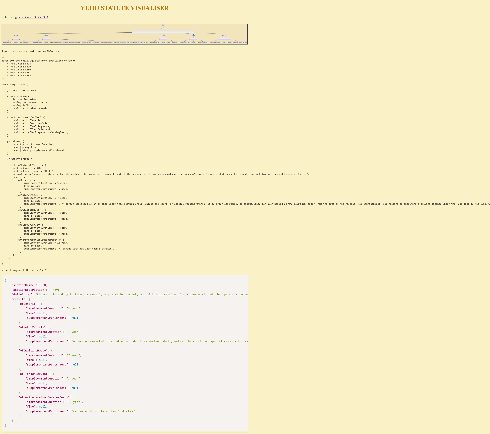

> [!NOTE]  
> WIP

# Frontend display

## Goals

* display evaluation of a statute *(situation -> fulfillment of predicates -> consequence)* as a flowchart
* navigate by stepping through each node of the flowchart
* aid understanding of statutes by
  * making key portions of a statute explicit
  * representing conditional logic clearly
  * display how different statutes relate to each other
* live editor that shows how mermaid flowchart fluxes as `yuho` code edited

## Usage

```console
$ cd front
$ npm install -g http-server
$ http-server -p 8000
```

## Screenshot


